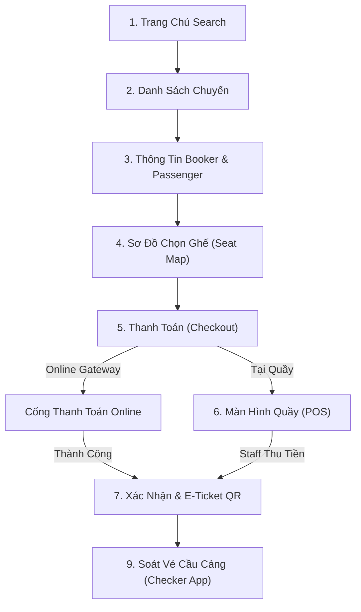

# Bức Tranh Tổng Quan & 9 Màn Hình Figma UI

Tài liệu phân tích luồng nghiệp vụ dựa trên **9 màn hình Figma UI đã được review trong hồ sơ gốc** (docs/nghiepvu.md:838).

---

## 🎯 Luồng Trải Nghiệm Khách Hàng (User Journey)

Luồng di chuyển chính của người dùng trải dài qua 9 màn hình giao diện công khai và quản trị:

| STT | Màn Hình Figma UI | Mô Tả Trải Nghiệm Khách Hàng | Endpoint & Hành Vi Backend |
| :--- | :--- | :--- | :--- |
| **1** | **Trang Chủ (Search)** | Chọn Bến đi, Bến đến, Loại vé (1 chiều / Khứ hồi), Ngày đi, Ngày về, Số lượng khách. | `POST /api/v1/search-trips` -> Tìm Hành trình (Journey), truy vấn các Chuyến (`Trips`) và kiểm tra kho ghế khả dụng. |
| **2** | **Danh Sách Chuyến Tàu** | Xem danh sách chuyến, giờ chạy, tên tàu, số ghế còn trống và bảng giá theo từng hạng. | `GET /api/v1/trips/{id}/availability` -> Trả về danh sách chuyến + Bảng giá tính dynamic qua `PricingTask`. |
| **3** | **Thông Tin Booker & Passenger** | Nhập thông tin Người đặt vé (Booker) và danh sách Hành khách (Passenger). | `POST /api/v1/bookings/draft` -> Tạo bản nháp Booking. Nếu Guest: chuẩn bị luồng xác minh OTP (DEC-035). |
| **4** | **Sơ Đồ Chọn Ghế (Seat Map)** | Trực quan hóa tầng (Deck), khoang (Zone) tàu. Bấm chọn vị trí ghế cụ thể. | `POST /api/v1/bookings/{id}/hold-seats` -> Kích hoạt MySQL Lock (`lockForUpdate`), giữ ghế với thời hạn lấy từ Cấu hình `Settings` (DEC-010). |
| **5** | **Thanh Toán (Checkout)** | Nhập mã Coupon, chọn yêu cầu xuất Hóa đơn bán lẻ (nếu cần), chọn phương thức (Online qua Gateway hoặc Quầy). | `POST /api/v1/payments/checkout` -> Nếu Online: khởi tạo `PAYMENT_ATTEMPT`; Nếu Quầy: sinh Booking Code `UNPAID` (DEC-006). |
| **6** | **Xác Nhận & Vé Điện Tử** | Nhận kết quả Đặt vé, mã Booking Code, Danh sách ghế và Mã QR Check-in. | `GET /api/v1/bookings/{id}/ticket-summary` -> Phát hành Vé điện tử (`Ticket`) sau khi Payment thành công (`PAID`). |
| **7** | **Tra Cứu Đơn Hàng (Guest Portal)** | Khách vãng lai nhập Booking Code + Email/SĐT để xem thông tin vé. | `POST /api/v1/guest/verify-otp` -> Xác minh OTP gửi qua SMS/Email trước khi cho xem/đổi thông tin (DEC-035). |
| **8** | **Quản Lý Phòng Vé (Counter POS)** | Nhân viên quầy tìm đơn `UNPAID`, thu tiền mặt, ấn xác nhận phát hành vé. | `POST /api/v1/counter/bookings/{id}/pay` -> Đổi trạng thái `PAID` và phát hành vé in tại quầy (DEC-008). |
| **9** | **Soát Vé Cầu Cảng (Checker App)** | Soát vé dùng máy quét quét mã QR hành khách tại cầu cảng. | `POST /api/v1/checkin/scan` -> Kiểm tra mã QR hợp lệ, ghi nhận trạng thái Boarded (DEC-022, DEC-037). |

---

## 🪨 Chi Tiết Luồng Tổng Thể

---

## 🗿 Grug Đúc Kết

<Callout type="tip">
  **🗿 Grug Kiến Trúc Mách Bảo**: *"9 màn hình Figma là 9 trạm dừng trên con đường đi tìm vé tàu! Màn hình nào cũng phải thông suốt thì khách mới vui vẻ lên tàu!"*
</Callout>
