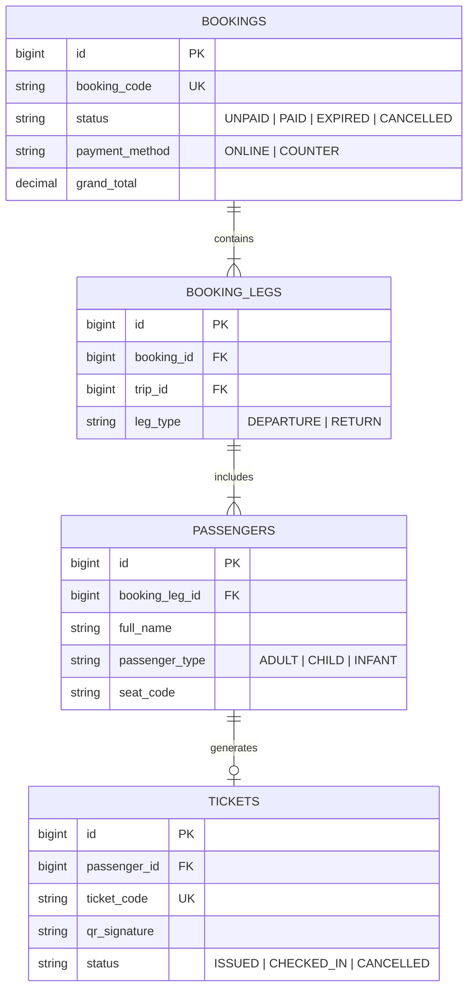

# Bức Tranh Tổng Quan Nghiệp Vụ Superdong

Hệ thống đặt vé tàu biển **Superdong** không phải là trang thương mại điện tử bán hàng hóa thông thường. Mỗi vé bán ra đại diện cho một **chỗ ngồi vật lý trên tàu biển**, tuân thủ luật hàng hải (Cảng vụ) và chịu tác động trực tiếp từ thời tiết, sóng gió.

---

## 🎯 Bài Toán Nghiệp Vụ Thực Tế

1. **Chống Bán Trùng Ghế (Zero Double Booking)**: 500 khách cùng đổ xô mua vé chuyến 8h00 sáng ngày mùng 1 Tết. Hệ thống phải đảm bảo ghế A12 chỉ thuộc về đúng 1 người.
2. **Luồng Thanh Toán Đa Dạng**: Hỗ trợ Thanh toán Online (khóa ghế 15 phút) và Thanh toán tại Quầy (khóa ghế đến `departure_time - X phút`, ban đầu chỉ cấp Booking Code chưa thanh toán, thu tiền xong mới phát hành Vé & QR).
3. **Biến Cố Hàng Hải**: Tàu lớn hỏng hóc phải đổi sang tàu nhỏ có sơ đồ ghế khác hoàn toàn; tàu bị hoãn/hủy do bão.

---

## 💡 Phân Tích Luồng 6 Màn Hình Figma UI (User Journey)

Luồng đặt vé trên giao diện web/app trải qua đúng 6 bước tương ứng với 6 màn hình thiết kế:

| Bước | Màn hình Figma | Thao tác Người Dùng (User) | Logic & API Backend Xử Lý (`E:\cty\superdong-be`) |
| :--- | :--- | :--- | :--- |
| **1** | **Trang Chủ (Search)** | Chọn Bến đi, Bến đến, Loại vé (1 chiều / Khứ hồi), Ngày đi, Ngày về, Số lượng khách (Người lớn, Trẻ em, Em bé...). | `POST /api/v1/search-trips` -> Tìm Hành trình (Journey), truy vấn các Chuyến (`Trips`) thỏa mãn lịch chạy và tính toán ghế trống khả dụng. |
| **2** | **Chọn Chuyến Tàu** | Xem danh sách chuyến, giờ chạy, tên tàu, số ghế còn trống theo từng hạng (Phổ thông, VIP) và bảng giá. | `GET /api/v1/trips/{id}/availability` -> Trả về danh sách chuyến + Giá vé tạm tính (Quote) dựa theo Nhóm hành khách. |
| **3** | **Thông Tin Booker & Passenger** | Nhập thông tin Người đặt vé (Booker: Email, SĐT) và danh sách Hành khách (Passenger: Họ tên, Ngày sinh/CCCD). | `POST /api/v1/bookings/draft` -> Tạo bản nháp Booking, kiểm tra loại khách vãng lai (Guest - gửi link tra cứu + OTP) hay Khách tài khoản (Account). |
| **4** | **Sơ Đồ Chọn Ghế (Seat Map)** | Trực quan hóa tầng (Deck), khoang (Zone) tàu. Khách bấm chọn vị trí ghế cụ thể cho từng lượt. | `POST /api/v1/bookings/{id}/hold-seats` -> Kích hoạt **Redis Distributed Lock** để giữ ghế chống bán trùng, cập nhật `held_seats` trong 15 phút. |
| **5** | **Thanh Toán (Checkout)** | Nhập mã Coupon, chọn xuất Hóa đơn bán lẻ, chọn phương thức (Online qua VNPAY/MoMo hoặc Tại quầy). | `POST /api/v1/payments/checkout` -> Nếu Online: redirect sang Gateway; Nếu Quầy: tạo Booking Code trạng thái `UNPAID` (chưa có vé/QR). |
| **6** | **Xác Nhận & E-Ticket** | Nhận kết quả Đặt vé thành công, xem mã Booking Code, Danh sách ghế và Mã QR Check-in. | `GET /api/v1/bookings/{id}/ticket-summary` -> Phát hành Vé điện tử (`Ticket`) & Mã QR hợp lệ sau khi xác nhận tiền đã thu (`PAID`). |

---

## 🪨 Chi Tiết ERD & Lý Giải TẠI SAO Cần Tách Biệt Dữ Liệu

Toàn bộ luồng 6 màn hình trên được vận hành bởi 4 bảng dữ liệu cốt lõi bên dưới DB:

### 🔍 Lý Giải TẠI SAO (Schema Rationale):
- **Vì sao tách `BOOKINGS` và `BOOKING_LEGS`?**: Để hỗ trợ đặt vé **Khứ hồi** (Chuyến đi và Chuyến về) trong cùng 1 Đơn hàng `BOOKING`. Mỗi chiều chạy là 1 `BOOKING_LEG`.
- **Vì sao `TICKETS` tách rời `PASSENGERS`?**: Đặt vé tại quầy hoặc online ban đầu chỉ tạo `BOOKING` & `PASSENGERS` ở trạng thái chưa thanh toán (`UNPAID`). **Chỉ khi tiền thực tế thu thành công**, hệ thống mới sinh bản ghi `TICKETS` kèm mã QR hợp lệ.

---

## 🗿 Grug Đúc Kết

<Callout type="tip">
  **🗿 Grug Kiến Trúc Mách Bảo**: *"Đơn hàng (Booking) chỉ là lời hứa mua vé! Tiền về tay tù trưởng thì hòn đá Mã QR mới phát sáng thành Vé (Ticket)!"*
</Callout>
