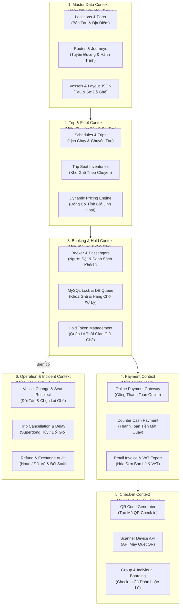
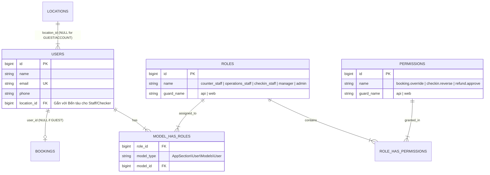

# Strategic Domain & Bounded Contexts

Để tránh codebase rơi vào **Thảm họa Spaghetti code (Big ball of mud)**, hệ thống Superdong được chia thành 6 **Ranh giới nghiệp vụ độc lập (Bounded Contexts)**. Mỗi Bounded Context quản lý một miền dữ liệu khép kín.

---

## 🎯 Bài Toán Ranh Giới Nghiệp Vụ

Nếu không phân rã Bounded Contexts, logic giữ ghế, tính giá vé, thanh toán và soát vé QR sẽ dính chặt vào nhau. Một thay đổi ở luồng soát vé bến tàu có thể làm sập luồng đặt vé online Tết!

---

## 💡 Phân Rã 6 Bounded Contexts Cốt Lõi

---

## 👥 Phân Định Actor Nghiệp Vụ & Spatie RBAC Mapping

🚨 **LƯU Ý KIẾN TRÚC QUAN TRỌNG**: "Actor Nghiệp Vụ" trong tài liệu **KHÔNG ĐỒNG NGHĨA với một giá trị cột enum `users.role`**. Dự án `E:\cty\superdong-be` **dùng package `Spatie\Permission`** với các bảng `roles`, `permissions`, `model_has_roles`. Bảng `users` tuyệt đối KHÔNG có cột `role` hay `roles`.

### 📌 Ma Trận Mapping Chuẩn Giữa Nghiệp Vụ & Mã Nguồn Backend

| Khái Niệm Actor | Cách Biểu Diễn Kỹ Thuật Trong Database & Codebase | Quyền Hạn & Giới Hạn An Toàn |
| :--- | :--- | :--- |
| **Khách Vãng Lai (GUEST)** | **Không có bản ghi `users`**. Bản ghi `BOOKING` có `user_id = NULL`. | Đặt vé không cần tài khoản (DEC-026). Thao tác nhạy cảm bằng link bảo mật + OTP (DEC-035). |
| **Khách Tài Khoản (ACCOUNT)** | **User đã đăng ký/đăng nhập** (`user_id != NULL`). Không phải 1 role Spatie. | Xem & quản lý lịch sử Booking do chính mình tạo (DEC-028, DEC-040). |
| **Nhân Viên Quầy** | Spatie Role: **`counter_staff`** (gán qua `model_has_roles`). | Bán vé tại quầy, thu tiền mặt, in vé. Gắn `location_id` để giới hạn bến (DEC-034). |
| **Nhân Viên Vận Hành** | Spatie Role: **`operations_staff`** (gán qua `model_has_roles`). | Đổi tàu khác sơ đồ, dời giờ chạy, xử lý chuyến bão hủy (DEC-002, DEC-011). |
| **Soát Vé Cầu Cảng** | Spatie Role: **`checkin_staff`** (gán qua `model_has_roles`). | Quét QR Code check-in. Cấm Check-in Offline trong MVP (DEC-037). |
| **Quản Lý Vận Hành** | Spatie Role: **`manager`** (gán qua `model_has_roles`). | Quyền cao cấp: Override hoàn tiền, sửa check-in nhầm (DEC-034, DEC-036). |
| **Admin Hệ Thống** | Spatie Role: **`admin`** (đã seed sẵn trong hệ thống). | Quản trị toàn bộ Master Data, Users và Cấu hình hệ thống. |

---

## 🪨 Chi Tiết ERD & Spatie Permission Schema

### 🔍 Lý Giải TẠI SAO (Schema Rationale):
- **Vì sao `GUEST` có `user_id = NULL` trong `BOOKINGS`?**: Để giảm tối đa ma sát checkout (DEC-029). Hệ thống không ép tạo User rác trong DB, tiết kiệm tài nguyên và đơn giản hóa truy vấn.
- **Vì sao dùng Spatie RBAC thay vì Cột Enum `role`?**: Giúp mở rộng quyền động (`permissions`) linh hoạt. Khi cần cấp riêng quyền `refund.approve` cho một nhân viên quầy lâu năm, ta gán trực tiếp qua `model_has_permissions` mà không cần sửa cấu trúc DB!

---

## 🗿 Grug Đúc Kết

<Callout type="tip">
  **🗿 Grug Kiến Trúc Mách Bảo**: *"Khách vãng lai (Guest) không có tên trên sổ bộ tộc (user_id = NULL)! Nhân viên (Staff) có huy hiệu thẻ Spatie `counter_staff` đeo trên cổ!"*
</Callout>
