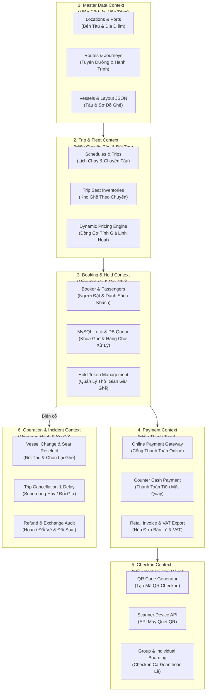
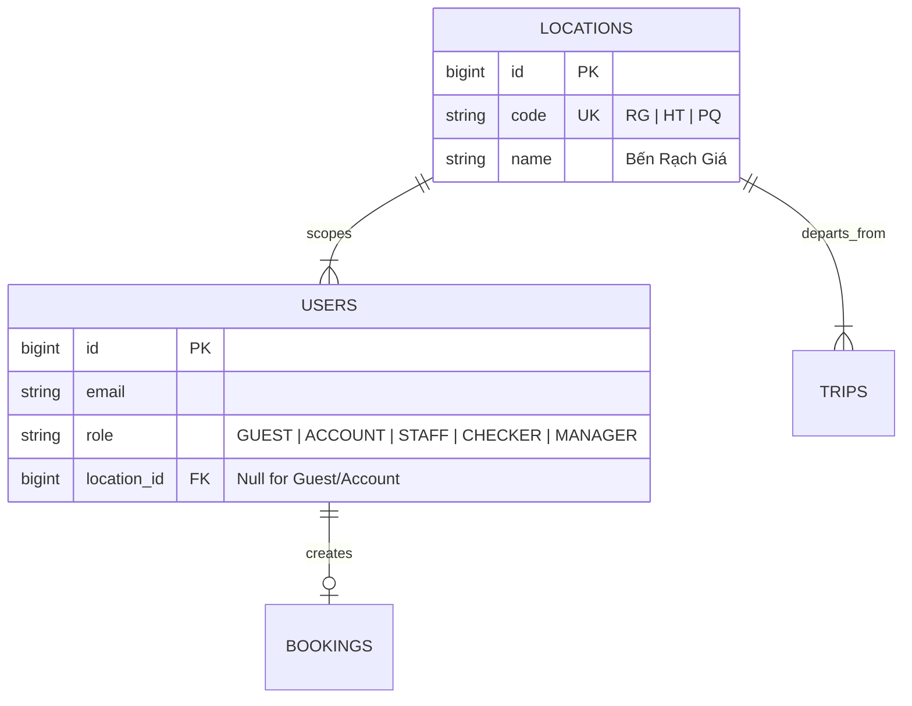

# Strategic Domain & Bounded Contexts

Để tránh codebase rơi vào **Thảm họa Spaghetti code (Big ball of mud)**, hệ thống Superdong được chia thành 6 **Ranh giới nghiệp vụ độc lập (Bounded Contexts)**. Mỗi Bounded Context quản lý một miền dữ liệu khép kín.

---

## 🎯 Bài Toán Ranh Giới Nghiệp Vụ

Nếu không phân rã Bounded Contexts, logic giữ ghế, tính giá vé, thanh toán và soát vé QR sẽ dính chặt vào nhau. Một thay đổi ở luồng soát vé bến tàu có thể làm sập luồng đặt vé online Tết!

---

## 💡 Phân Rã 6 Bounded Contexts Cốt Lõi

---

## 👥 Actor Matrix (Ma Trận Người Dùng)

Hệ thống phục vụ 5 nhóm tác nhân chính với phạm vi quyền hạn tách biệt:

| Actor (Tác nhân) | Hình thức Truy cập | Vai trò & Quyền hạn Nghiệp vụ | Giới hạn An toàn Backend |
| :--- | :--- | :--- | :--- |
| **Khách Vãng Lai (Guest)** | Web Public (No Login) | Tìm chuyến, đặt vé, chọn ghế, thanh toán. Nhận link tra cứu vé qua Email. | Phải xác minh OTP khi đổi thông tin hoặc hủy vé (DEC-035). |
| **Khách Tài Khoản (Account)** | Web/App Member | Đặt vé nhanh, lưu thông tin hành khách, nhận ưu đãi khuyến mãi riêng. | Chỉ xem & quản lý Booking do chính mình tạo (DEC-040). |
| **Nhân Viên Quầy (Staff)** | Backoffice App | Bán vé tại quầy, thu tiền mặt, in vé, hỗ trợ khách đổi/hủy vé theo chính sách. | Phân quyền theo Bến (Station-scoped RBAC - DEC-034). |
| **Soát Vé (Checker)** | Thiết bị Handheld QR | Quét mã QR tại cầu cảng để xác nhận hành khách lên tàu (Boarded). | Chỉ quét check-in online; Cấm Check-in Offline (DEC-037). |
| **Quản Lý (Manager)** | Backoffice Admin | Đổi tàu, hủy/hoãn chuyến, duyệt hoàn tiền, ghi đè check-in nhầm, xem Audit Log. | Có quyền Override & thao tác biến cố vận hành cao nhất. |

---

## 🪨 Chi Tiết ERD & Lý Giải TẠI SAO

### 🔍 Lý Giải TẠI SAO (Schema Rationale):
- **Vì sao `USERS` có `location_id` (FK)?**: Nhân viên phòng vé (`STAFF`) tại Bến Rạch Giá (`location_id`) không được phép bán vé hay chỉnh sửa chuyến của Bến Hà Tiên. Phân quyền RBAC gắn chặt với Bến tàu (`location_id`).
- **Vì sao `GUEST` không cần tạo Account?**: Để giảm tối đa ma sát checkout (DEC-029). Hệ thống tự sinh `guest_session` và mã bảo mật tra cứu qua Email/SMS.

---

## 🗿 Grug Đúc Kết

<Callout type="tip">
  **🗿 Grug Kiến Trúc Mách Bảo**: *"Người rừng đi săn (Guest) không cần đăng ký hộ khẩu cảng! Chỉ cần để lại tên và số điện thoại, Grug đưa vé là xong!"*
</Callout>
