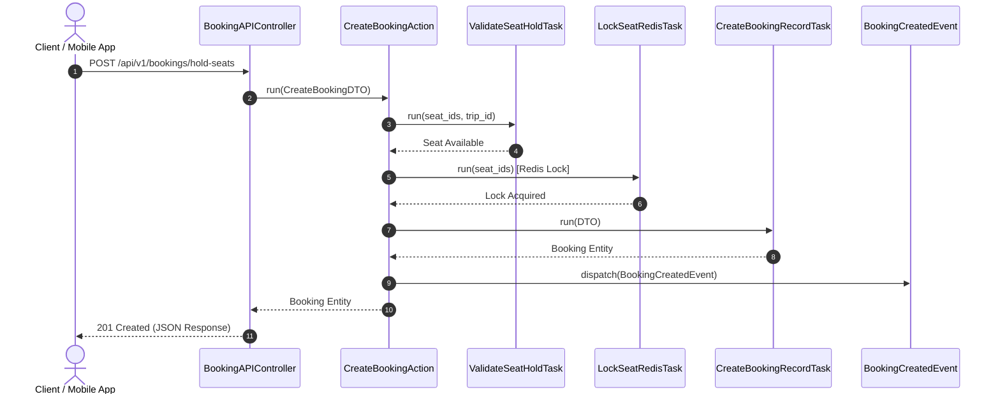

# Porto Container Architecture

Dự án **`E:\cty\superdong-be`** áp dụng **Kiến trúc Porto (Porto Container Architecture)**. Porto chia mã nguồn thành 2 lớp chính: **Containers** (Chứa logic nghiệp vụ từng miền) và **Ship** (Chứa hạ tầng dùng chung).

---

## 🎯 Bài Toán Tổ Chức Mã Nguồn (Code Organization)

Trong các dự án MVC truyền thống, `BookingController` thường trở thành "Fat Controller" dài 3,000 dòng code, chứa cả logic giữ ghế, gửi mail, tính giá và gọi VNPAY. Kiến trúc Porto giải quyết triệt để vấn đề này nhờ quy tắc **Single Task (Tác vụ đơn lẻ)**.

---

## 💡 Cấu Trúc Mã Nguồn Porto Pattern Trong Superdong


```text
app/
├── Containers/
│   ├── AppSection/
│   │   ├── Booking/           <-- Container Đặt vé & Giữ ghế
│   │   │   ├── Actions/       <-- Orchestrator (Điều phối luồng)
│   │   │   ├── Tasks/         <-- Single Action (Nhiệm vụ đơn lẻ)
│   │   │   ├── Models/        <-- Eloquent Models (Booking, BookingLeg)
│   │   │   ├── UI/WEB/        <-- Web Controllers & Requests
│   │   │   └── UI/API/        <-- API Controllers & Resources
│   │   ├── Payment/           <-- Container Thanh toán VNPAY/MoMo
│   │   ├── Fleet/             <-- Container Quản lý Tàu & Sơ đồ ghế
│   │   └── Checkin/           <-- Container QR Code & Soát vé
└── Ship/                      <-- Lớp hạ tầng trung tâm
    ├── Parents/               <-- Base Classes (Actions, Tasks, Models)
    └── Exceptions/            <-- Exception Handler tập trung
```

### ⚡ Phân Định Vai Trò: Action vs Task

| Thành phần Porto | Vai Trò & Nhiệm Vụ | Quy Tắc Lập Trình |
| :--- | :--- | :--- |
| **Action** | **Bộ Điều Phối (Orchestrator)**: Nhận DTO từ Controller, gọi nhiều Tasks theo thứ tự để hoàn thành 1 Use Case. | Không chứa SQL Query trực tiếp. Gọi 2-5 Tasks nhỏ. |
| **Task** | **Nhiệm Vụ Đơn Lẻ (Single Operation)**: Thực hiện đúng 1 việc duy nhất (ví dụ: `HoldSeatTask`, `CalculateQuoteTask`). | Reusable 100%. Không gọi Action khác. |
| **DataTransfers (DTO)** | **Đối Tượng Truyền Dữ Liệu**: Đóng gói payload từ Controller chuyển cho Action. | Strongly-typed, Immutable. |

---

## 🪨 Luồng Xử Lý Mã Nguồn: Đặt Vé & Giữ Ghế



---

## 🗿 Grug Đúc Kết

<Callout type="tip">
  **🗿 Grug Kiến Trúc Mách Bảo**: *"Tù trưởng Action chỉ đứng chỉ tay phân việc! Rìu đá Task nào lo chặt cây Task đó, không giẫm chân lên nhau!"*
</Callout>
