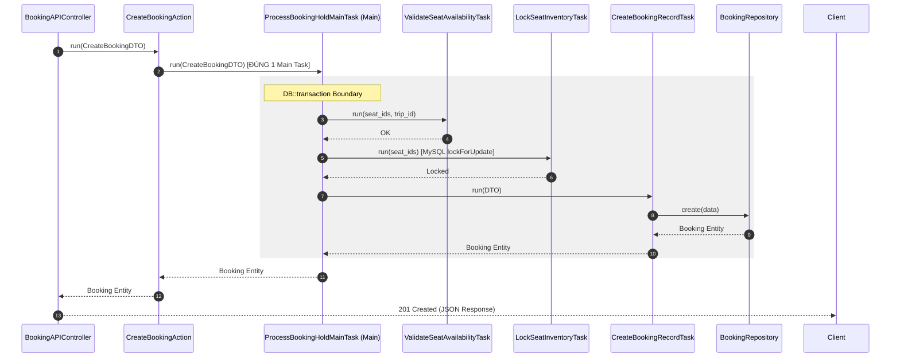

# Porto Container Architecture & Action-Task Rules

Dự án Superdong tuân thủ nghiêm ngặt **Quy tắc thiết kế Porto Container Architecture** (AGENTS.md:33-34) để đảm bảo tính phân rã, dễ kiểm thử và không vi phạm Architecture Tests.

---

## 🎯 Quy Tắc Cốt Lõi Porto Pattern

```
 ┌────────────────────────────────────────────────────────┐
 │ 1. UI / API Controller                                 │
 │    - Tiếp nhận HTTP Request, Validate DTO               │
 └───────────────────────────┬────────────────────────────┘
                             │
                             ▼
 ┌────────────────────────────────────────────────────────┐
 │ 2. Action (Đúng 1 Main Task)                           │
 │    - Gọi ĐÚNG 1 Main Task duy nhất                     │
 │    - KHÔNG mở Transaction, KHÔNG orchestration         │
 └───────────────────────────┬────────────────────────────┘
                             │
                             ▼
 ┌────────────────────────────────────────────────────────┐
 │ 3. Main Task (Orchestrator & Transaction Boundary)     │
 │    - Mở DB Transaction, điều phối các Child Tasks      │
 └─────────────┬────────────────────────────┬─────────────┘
               │                            │
               ▼                            ▼
 ┌──────────────────────────┐  ┌──────────────────────────┐
 │ 4a. Child Task 1         │  │ 4b. Child Task 2         │
 │ (Validate / Lock)        │  │ (Create Record / Event)  │
 └─────────────┬────────────┘  └────────────┬─────────────┘
               │                            │
               ▼                            ▼
 ┌────────────────────────────────────────────────────────┐
 │ 5. Repositories / Eloquent Models                      │
 └────────────────────────────────────────────────────────┘
```

---

## 💡 Phân Định Trách Nhiệm Trong Porto Pattern


1. **Controller**:
   - Gọi `CreateBookingDTO::fromRequest($request)`.
   - Chuyển DTO cho Action xử lý và trả về `JsonResponse`.
2. **Action (Ví dụ: `CreateBookingAction`)**:
   - **Quy tắc bắt buộc**: Action CHỈ GỌI ĐÚNG 1 Main Task (`ProcessBookingHoldMainTask`).
   - Action KHÔNG chứa logic nghiệp vụ, KHÔNG gọi trực tiếp Repository, KHÔNG tự mở `DB::transaction()`.
3. **Main Task (Ví dụ: `ProcessBookingHoldMainTask`)**:
   - Là nơi quản lý Ranh giới Giao dịch (`DB::transaction()`).
   - Điều phối thứ tự thực thi của các Child Tasks:
     - `ValidateSeatAvailabilityTask`: Kiểm tra ghế khả dụng.
     - `LockSeatInventoryTask`: Thực hiện MySQL `lockForUpdate`.
     - `CreateBookingRecordTask`: Tạo bản ghi Booking.
     - `DispatchBookingCreatedEventTask`: Ghi nhận sự kiện nghiệp vụ.

---

## 🪨 Luồng Thực Thi Chi Tiết (Sequence Diagram)



---

## 🗿 Grug Đúc Kết

<Callout type="tip">
  **🗿 Grug Kiến Trúc Mách Bảo**: *"Một Action chỉ được trao niềm tin cho ĐÚNG MỘT Main Task! Main Task là thuyền trưởng tự mở rương DB Transaction và sai bảo các con thuyền nhỏ!"*
</Callout>
