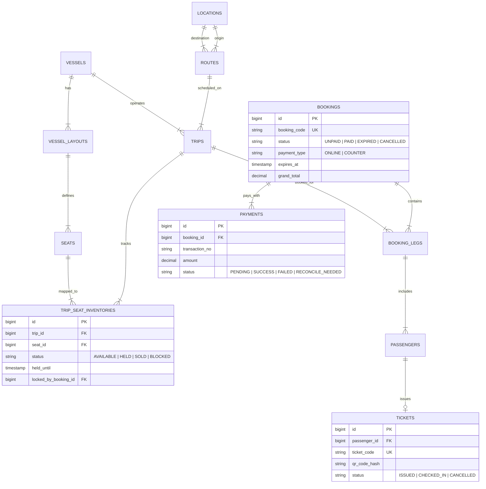

# ERD Database Design & 41 Architecture Decisions

Cơ sở dữ liệu của Superdong là **Nguồn chân lý duy nhất (Single Source of Truth - SSOT)** cho mọi giao dịch chuyến, giữ ghế, bán vé và doanh thu.

---

## 🪨 Sơ Đồ ERD Database Tổng Thể

### 🔍 Lý Giải TẠI SAO (Schema Rationale):

1. **Tại sao `TRIP_SEAT_INVENTORIES` tách rời `SEATS`?**:
   - Bảng `SEATS` lưu vị trí ghế vật lý cố định trên tàu (ví dụ: Tầng 1, Khoang A, Ghế 01).
   - Tàu chạy 10 chuyến mỗi ngày -> Cùng ghế 01 đó sẽ có 10 trạng thái riêng biệt ở 10 chuyến khác nhau. Bảng `TRIP_SEAT_INVENTORIES` đóng vai trò theo dõi trạng thái `AVAILABLE`, `HELD`, `SOLD` theo từng `trip_id`.
2. **Tại sao `PAYMENTS` có trạng thái `RECONCILE_NEEDED`?**:
   - Theo quyết định **DEC-030** (Anh Hiếu chốt): Nếu tiền về Gateway thành công **sau khi Booking đã bị Cronjob tự động nhả ghế (EXPIRED)**, hệ thống không tự phục hồi đơn mà đánh dấu Payment thành `RECONCILE_NEEDED` để Staff xử lý thủ công.

---

## 📋 Danh Mục 41 Quyết Định Kiến Trúc & Nghiệp Vụ (DEC-001 đến DEC-041)

### 📌 Quyết Định Từ Anh Hùng (DEC-001 đến DEC-029)

| Mã DEC | Quyết Định Nghiệp Vụ | Tác Động Logic Backend |
| :--- | :--- | :--- |
| **DEC-001** | Backend mới làm chủ 100% Chuyến, Ghế và Đơn đặt vé. | Không phụ thuộc vào hệ thống POS cũ cho core logic. |
| **DEC-002** | Đổi tàu làm thay đổi sơ đồ ghế -> Khách được tự chọn lại ghế trên sơ đồ mới. | Gửi notification chứa link chọn lại ghế trên sơ đồ tàu mới. |
| **DEC-003** | Khách không chọn lại ghế đúng hạn -> Staff chọn thủ công trên sơ đồ. | Không tự động ánh xạ mã ghế cũ sang mã ghế mới. |
| **DEC-004** | MVP chưa làm thuật toán tự động xếp gia đình ngồi gần nhau. | Staff thao tác thủ công xếp chỗ trên giao diện Admin. |
| **DEC-005** | Người thực hiện đổi tàu nhập Hạn chót (Deadline) để khách chọn lại ghế. | Lưu `reselect_deadline` trong sự kiện Đổi tàu. |
| **DEC-006** | Thanh toán tại quầy chỉ cấp Booking Code chưa thanh toán (`UNPAID`). | Ban đầu không sinh bản ghi `TICKETS` và không có QR Code. |
| **DEC-007** | Booking chưa thanh toán không có vé hoặc QR hợp lệ để lên tàu. | QR Scanner API chặn 100% Booking chưa `PAID`. |
| **DEC-008** | Staff xác nhận đã thu tiền -> Hệ thống mới phát hành Vé và QR Code. | Trigger event `PaymentReceivedEvent` -> Sinh Ticket & QR. |
| **DEC-009** | Booking quầy chưa thu tiền giữ ghế đến `expires_at = departure_time - X phút`. | Cronjob quét và nhả ghế khi chạm mốc `expires_at`. |
| **DEC-010** | Giá trị `X` phút được quản lý trong Settings (không write hardcode trong code). | Trích xuất `X` từ `versioned_settings` table. |
| **DEC-011** | Superdong hủy chuyến -> Khách được chọn Hoàn 100% tiền hoặc Đổi chuyến khác. | Đưa Booking vào trạng thái `PENDING_CUSTOMER_ACTION`. |
| **DEC-012** | Superdong đổi giờ chạy -> Giữ nguyên vé và ghế, gửi thông báo giờ mới. | Cập nhật `departure_time` của Trip, gửi SMS/Email. |
| **DEC-013** | Đổi giờ chạy mà khách không đồng ý -> Được chọn Đổi chuyến hoặc Hoàn 100% tiền. | Cung cấp UI portal cho khách chọn phương án. |
| **DEC-014** | Hủy vé hỗ trợ Staff duyệt thủ công hoặc Hệ thống tự động theo cấu hình. | Bật/tắt qua Feature Toggle trong Settings. |
| **DEC-015** | Đổi chuyến hỗ trợ tại Quầy, Gửi yêu cầu Web hoặc Khách tự đổi trực tuyến. | Cung cấp 3 API endpoints riêng biệt cho 3 kênh. |
| **DEC-016** | Các hình thức đổi chuyến có thể bật/tắt bằng cấu hình. | Kiểm tra Config trước khi cho phép đổi chuyến. |
| **DEC-017** | Giá vé được cấu hình linh hoạt theo các trục nghiệp vụ. | Fare Engine tính theo Hành trình, Group, Zone, Thời gian. |
| **DEC-018** | Xác định Hành trình (Journey) trước khi tính giá và kiểm tra ghế trống. | API bắt buộc truyền `journey_id` trước `trip_id`. |
| **DEC-019** | Công ty tự tạo và cấu hình các Nhóm hành khách (Passenger Types). | Dynamic master data trong bảng `passenger_types`. |
| **DEC-020** | Việc Em bé có ghế riêng hay không được điều khiển bằng cấu hình. | Boolean config `infant_requires_seat`. |
| **DEC-021** | Khuyến mãi có thể áp dụng cho toàn Booking hoặc từng Hành khách. | `discounts` table hỗ trợ `scope = BOOKING | PASSENGER`. |
| **DEC-022** | QR Code hỗ trợ Check-in toàn bộ đơn hoặc riêng từng hành khách. | QR chứa `booking_code` (đoàn) hoặc `ticket_code` (lẻ). |
| **DEC-023** | Quy tắc cộng dồn Coupon được cấu hình riêng trên từng mã. | Flag `is_stackable` trong bảng `coupons`. |
| **DEC-024** | Hóa đơn VAT được phát hành qua hệ thống bên ngoài. | Tích hợp Async Webhook/Queue đẩy data VAT. |
| **DEC-025** | Hệ thống mới phát hành Hóa đơn Bán lẻ (Retail Sales Receipt). | Sinh PDF/Print Hóa đơn bán lẻ nội bộ ngay tại quầy. |
| **DEC-026** | Khách không bắt buộc đăng nhập để đặt vé. | Cho phép Checkout dưới dạng Guest. |
| **DEC-027** | Khách vãng lai bắt buộc cung cấp SĐT/Email và nhận link tra cứu vé. | Send Grid / Local SMS gửi Secure Hash URL. |
| **DEC-028** | Khách có tài khoản được xem lịch sử và nhận ưu đãi riêng. | Auth Guard cho phép lưu `user_id` vào `bookings`. |
| **DEC-029** | Luồng đặt vé và thanh toán phải tối ưu, giảm tối đa cản trở. | Không bắt đăng ký tài khoản gây ngắt đoạn checkout. |

---

### 📌 Quyết Định Từ Anh Hiếu (DEC-030 đến DEC-041)

| Mã DEC | Quyết Định Nghiệp Vụ | Tác Động Logic Backend |
| :--- | :--- | :--- |
| **DEC-030** | Payment thành công SAU KHI Booking hết hạn (`EXPIRED`) -> Không khôi phục đơn, chuyển Staff xử lý thủ công. | Tạo bản ghi `payment_reconciliations`, đánh dấu `RECONCILE_NEEDED`. |
| **DEC-031** | Payment ở trạng thái `UNKNOWN` -> Khóa không cho tạo Payment mới cho đến khi đối soát xong. | Lock Booking state `PAYMENT_LOCKED`. |
| **DEC-032** | Chính sách hủy vé cấu hình theo mốc thời gian, mức phí và % hoàn tiền. | Matrix phạt phí trong `cancellation_policies`. |
| **DEC-033** | Booking đã sử dụng một phần (Partially used) -> Không tự động hoàn tiền, Staff xem xét từng ca. | Chặn API Auto-Refund nếu có ít nhất 1 leg đã check-in. |
| **DEC-034** | Phân quyền RBAC tách theo Quầy, Vận hành, Soát vé, Quản lý. Refund/Override thuộc Quản lý. | Permission Gate: `refund.override` chỉ gán cho `Role::MANAGER`. |
| **DEC-035** | Khách vãng lai thao tác nhạy cảm (đổi/hủy/sửa SĐT) bắt buộc xác minh OTP. | Require `otp_token` trước khi thực thi Action. |
| **DEC-036** | Chỉ Quản lý được sửa Check-in nhầm trước giờ khởi hành và bắt buộc nhập lý do. | Audit Log ghi nhận `override_reason` bắt buộc. |
| **DEC-037** | MVP KHÔNG hỗ trợ Check-in Offline. Kết nối mạng ngắt -> Không cho check-in. | Client App không lưu cache check-in local. |
| **DEC-038** | Chỉ sử dụng đơn vị tiền VND, làm tròn tại Tổng tiền cuối cùng của Booking. | `Math.round()` ở dòng cuối cùng của Quote Engine. |
| **DEC-039** | Cấm Hard Delete Booking/Payment/Ticket. Xử lý dữ liệu cá nhân theo quy trình thủ công. | Áp dụng Soft Delete hoặc Status State Machine. |
| **DEC-040** | Booker quản lý Booking; Passenger chỉ xem vé của chính mình, không được sửa Booking. | Access Policy kiểm tra `booker_id` vs `passenger_id`. |
| **DEC-041** | Audit Log bắt buộc lưu ai, khi nào, lý do, data before/after. Đọc append-only, cấm sửa/xóa. | `audit_logs` table chỉ cho phép `INSERT` operation. |

---

## 🗿 Grug Đúc Kết

<Callout type="tip">
  **🗿 Grug Kiến Trúc Mách Bảo**: *"41 Luật bộ tộc khắc trên bia đá! Sếp Hùng chốt từ 1 tới 29, Sếp Hiếu chốt nốt từ 30 tới 41! Code đúng bia đá là không bao giờ ăn gậy!"*
</Callout>
