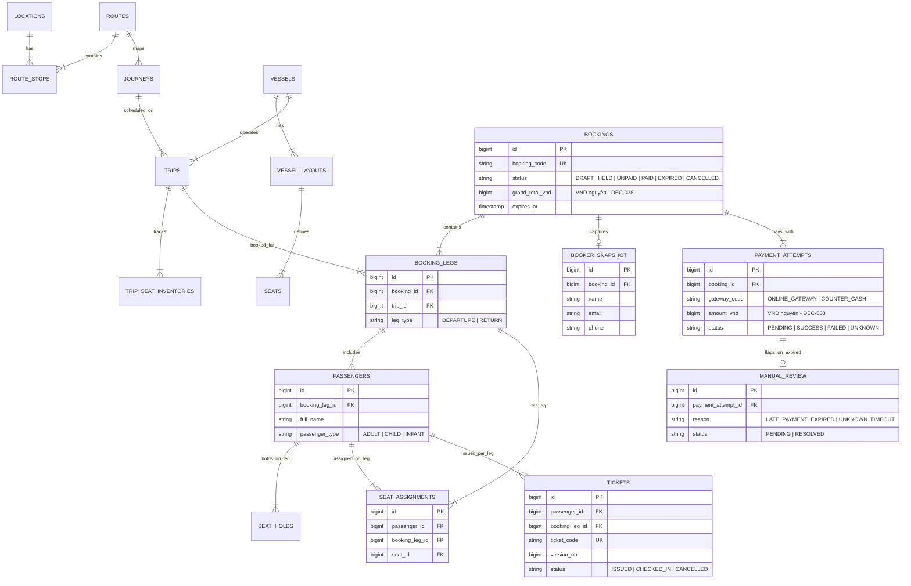

# Logical ERD Design & 41 Architecture Decisions

Tài liệu thiết kế cơ sở dữ liệu dựa trên **Logical ERD nguồn đã phê duyệt** (docs/architecture/erd.md) và Bảng tổng hợp **41 Architecture Decisions (DEC-001 đến DEC-041)**.

---

## 🎯 Sơ Đồ Logical ERD Tổng Thể

---

## 🔍 Lý Giải TẠI SAO (Schema Rationale):

1. **Vì sao tiền dùng `bigint` / VND nguyên (`grand_total_vnd`)?**:
   - Tuân thủ **DEC-038**: Hệ thống chỉ dùng đơn vị VND, không lưu số lẻ thập phân và làm tròn tại Tổng tiền cuối cùng trong PHP Pricing Task.
2. **Vì sao `SEAT_ASSIGNMENTS` tách theo `Passenger + Booking Leg`?**:
   - Khách mua vé khứ hồi có thể ngồi ghế `A01` ở lượt đi nhưng ngồi ghế `B12` ở lượt về.
3. **Vì sao dùng CSDL MySQL với kiểu dữ liệu `json`?**:
   - CSDL chính là MySQL, lưu trữ cấu hình layout tàu và dữ liệu payload dưới dạng kiểu native `json` chuẩn của MySQL.
4. **Vì sao không dùng Soft Delete / Hard Delete?**:
   - Tuân thủ **DEC-039**: Dữ liệu giao dịch không dùng `SoftDeletes` hay `DELETE`. Vòng đời thực thể quản lý 100% bằng State Machine (`status`).

---

## 📋 Bảng Tổng Hợp 41 Architecture Decisions (DEC-001 đến DEC-041)

| Mã DEC | Nội Dung Quyết Định Nghiệp Vụ | Người Chốt |
|---|---|---|
| **DEC-001** | Backend mới làm chủ toàn bộ Chuyến, Ghế và Đơn đặt vé. | Anh Hùng |
| **DEC-002** | Khi đổi tàu làm thay đổi sơ đồ, khách được tự chọn lại ghế trên sơ đồ mới. | Anh Hùng |
| **DEC-003** | Khách không chọn lại ghế đúng hạn thì nhân viên chọn ghế thủ công trên sơ đồ. | Anh Hùng |
| **DEC-004** | MVP chưa làm thuật toán tự động xếp các hành khách cùng đơn ngồi gần nhau. | Anh Hùng |
| **DEC-005** | Người thực hiện đổi tàu nhập hạn cuối để khách chọn lại ghế. | Anh Hùng |
| **DEC-006** | Thanh toán tại quầy chỉ cấp Booking Code chưa thanh toán (`UNPAID`). | Anh Hùng |
| **DEC-007** | Booking chưa thanh toán không có vé hoặc QR hợp lệ để lên tàu. | Anh Hùng |
| **DEC-008** | Nhân viên xác nhận đã thu tiền thì hệ thống mới phát hành vé và QR. | Anh Hùng |
| **DEC-009** | Booking thanh toán tại quầy hết hạn trước giờ khởi hành `X` phút. | Anh Hùng |
| **DEC-010** | Giá trị `X` được quản lý trong Cấu hình (`Settings`), không viết cứng trong mã nguồn. | Anh Hùng |
| **DEC-011** | Khi Superdong hủy chuyến, khách chọn hoàn toàn bộ tiền hoặc chuyển sang chuyến khác. | Anh Hùng |
| **DEC-012** | Khi đổi giờ chạy, vé và ghế được giữ nguyên. | Anh Hùng |
| **DEC-013** | Khách không chấp nhận giờ mới được chuyển chuyến hoặc hoàn tiền. | Anh Hùng |
| **DEC-014** | Hủy vé hỗ trợ nhân viên duyệt thủ công hoặc hệ thống tự động xử lý theo cấu hình. | Anh Hùng |
| **DEC-015** | Đổi chuyến hỗ trợ tại quầy, gửi yêu cầu trên website hoặc khách tự đổi trực tuyến. | Anh Hùng |
| **DEC-016** | Các hình thức đổi chuyến được bật hoặc tắt bằng cấu hình. | Anh Hùng |
| **DEC-017** | Giá vé được cấu hình linh hoạt theo các yếu tố nghiệp vụ. | Anh Hùng |
| **DEC-018** | Phải xác định hành trình trước khi tính giá và kiểm tra ghế trống. | Anh Hùng |
| **DEC-019** | Công ty được tự tạo và cấu hình các nhóm hành khách. | Anh Hùng |
| **DEC-020** | Việc em bé có ghế riêng được bật hoặc tắt bằng cấu hình. | Anh Hùng |
| **DEC-021** | Khuyến mãi có thể áp dụng cho toàn Booking hoặc từng hành khách. | Anh Hùng |
| **DEC-022** | QR hỗ trợ Check-in toàn bộ hành khách hoặc riêng từng hành khách. | Anh Hùng |
| **DEC-023** | Quy tắc cho phép cộng dồn được cấu hình riêng trên từng Coupon. | Anh Hùng |
| **DEC-024** | Hóa đơn VAT được phát hành qua hệ thống bên ngoài. | Anh Hùng |
| **DEC-025** | Hệ thống mới hỗ trợ quản lý hoặc phát hành hóa đơn bán lẻ. | Anh Hùng |
| **DEC-026** | Khách không bắt buộc đăng nhập để đặt vé. | Anh Hùng |
| **DEC-027** | Khách vãng lai phải cung cấp thông tin liên hệ và nhận link tra cứu vé qua Email. | Anh Hùng |
| **DEC-028** | Khách có tài khoản được quản lý lịch sử và nhận chương trình khuyến mãi dành riêng. | Anh Hùng |
| **DEC-029** | Luồng đặt vé và thanh toán phải thuận tiện, không bắt đăng ký tài khoản gây cản trở. | Anh Hùng |
| **DEC-030** | Payment thành công sau khi Booking hết hạn không tự khôi phục Booking; giao dịch chuyển cho nhân viên xử lý thủ công (`MANUAL_REVIEW`). | Anh Hiếu |
| **DEC-031** | Khi Payment đang ở trạng thái chưa rõ kết quả (`UNKNOWN`), khách không được tạo Payment mới cho đến khi hoàn tất đối soát. | Anh Hiếu |
| **DEC-032** | Chính sách khách chủ động hủy vé được cấu hình theo các mốc thời gian, mức phí và phần trăm hoàn tiền. | Anh Hiếu |
| **DEC-033** | Booking đã sử dụng một phần không được tự động hoàn tiền; nhân viên xem xét và quyết định từng trường hợp. | Anh Hiếu |
| **DEC-034** | Quyền nhân viên được tách theo vai trò Quầy, Vận hành, Soát vé và Quản lý; refund, override thuộc vai trò Quản lý. | Anh Hiếu |
| **DEC-035** | Khách vãng lai truy cập Booking bằng link bảo mật; thao tác nhạy cảm phải xác minh OTP. | Anh Hiếu |
| **DEC-036** | Chỉ Quản lý được sửa Check-in nhầm trước giờ khởi hành và bắt buộc nhập lý do. | Anh Hiếu |
| **DEC-037** | MVP không hỗ trợ Check-in Offline; khi mất kết nối không ghi nhận Check-in mới trên hệ thống. | Anh Hiếu |
| **DEC-038** | Hệ thống chỉ sử dụng VND, không lưu số lẻ và làm tròn tại tổng tiền cuối cùng của Booking. | Anh Hiếu |
| **DEC-039** | Không hard delete Booking, Payment, Ticket và Check-in; lifecycle quản lý hoàn toàn bằng State Machine. | Anh Hiếu |
| **DEC-040** | Người đặt vé quản lý Booking; hành khách chỉ được xem vé của chính mình, không tự thay đổi Booking. | Anh Hiếu |
| **DEC-041** | Audit bắt buộc lưu người thao tác, thời gian, lý do và dữ liệu trước/sau; chỉ Quản lý được xem và audit không được sửa hoặc xóa. | Anh Hiếu |

---

## 🗿 Grug Đúc Kết

<Callout type="tip">
  **🗿 Grug Kiến Trúc Mách Bảo**: *"41 điều luật đục trên bia đá là chân lý của bộ tộc! Không tự nghĩ ra luật mới, chỉ làm đúng theo lời tù trưởng đã dặn!"*
</Callout>
