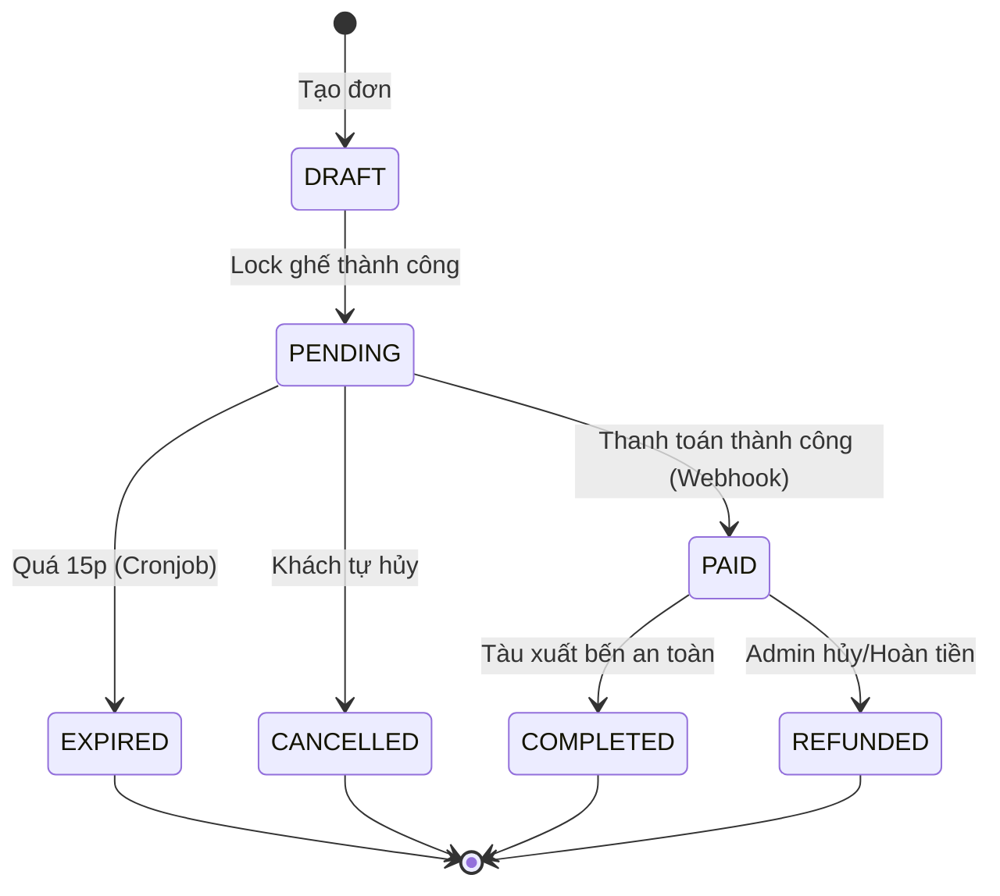
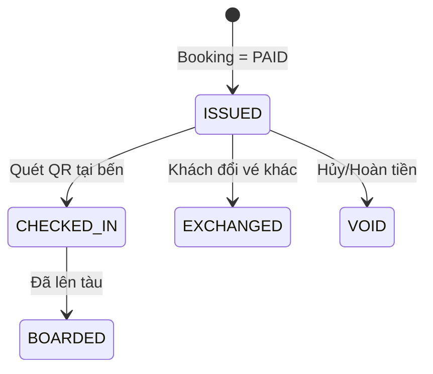
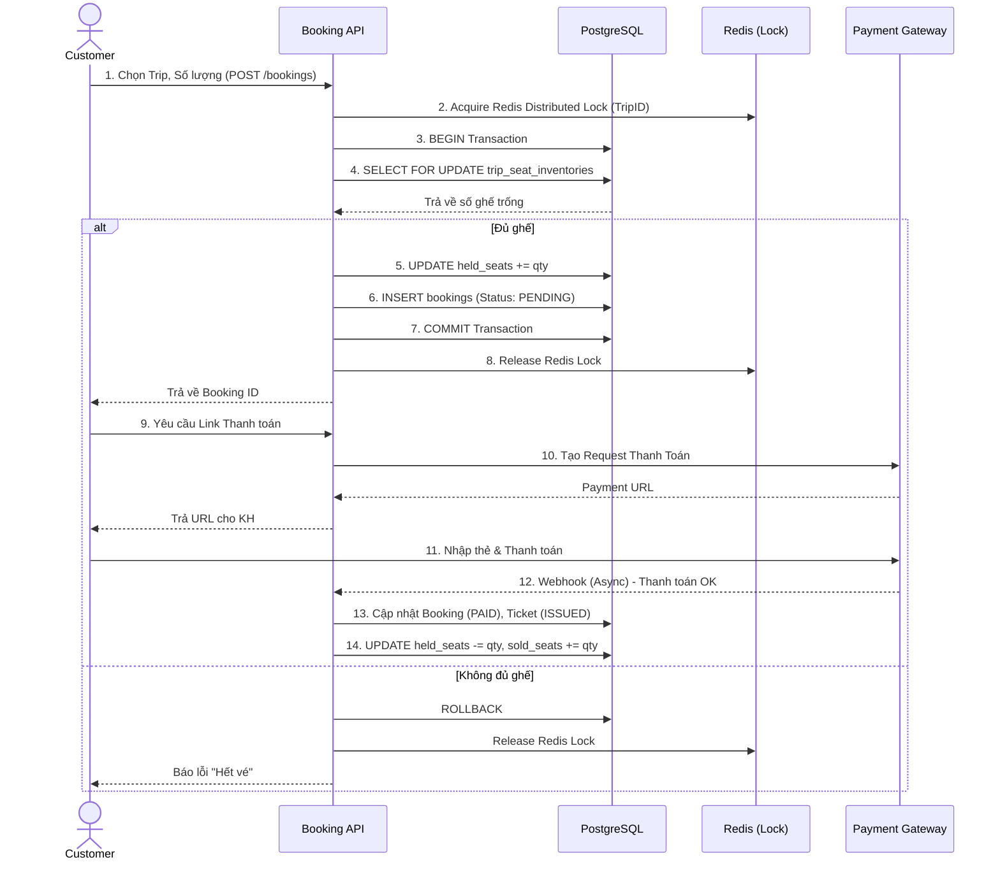
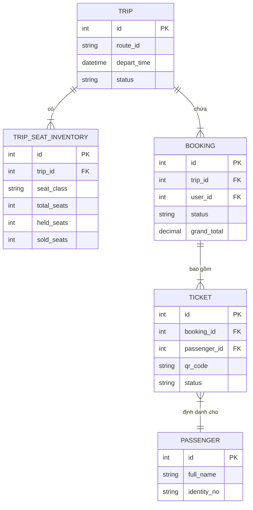

# Phụ Lục Sơ Đồ Kiến Trúc

Đây là phụ lục tổng hợp các bản vẽ (Diagram) trực quan hóa luồng nghiệp vụ phức tạp của hệ thống Superdong Booking.

## I. Sơ Đồ Chuyển Trạng Thái (State Machine)

### 1. Booking State Machine

### 2. Ticket State Machine

## II. Sơ Đồ Tuần Tự (Sequence Diagram)

### Luồng Đặt Vé và Thanh Toán Cơ Bản (Happy Path)

## III. Sơ Đồ ERD Rút Gọn (Core Diagram)

<Callout type="info">
  **Bản đồ liên kết ngữ cảnh (Context Map)**
  Các sơ đồ trên thể hiện sự giao tiếp chéo giữa các Domain. Đặc biệt là luồng Sequence, nó minh họa rõ cơ chế Database Lock nhằm giải quyết Race Condition một cách triệt để.
</Callout>
