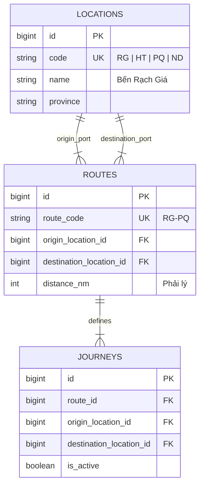

# Master Data: Bến Tàu, Tuyến Đường & Hành Trình

Tất cả các giao dịch trong hệ thống đều xuất phát từ việc xác định hành khách muốn đi từ đâu tới đâu.

---

## 🎯 Bài Toán Nghiệp Vụ

Khách hàng muốn đi từ **Rạch Giá -> Phú Quốc**. Nhưng chuyến tàu thực tế có thể ghé qua **Hòn Tre** hoặc **Hòn Sơn**. Hệ thống phải phân định rõ đâu là Bến dừng (`LOCATION`), đâu là Tuyến vận hành (`ROUTE`) và đâu là Cặp điểm đi/đến mà khách tìm kiếm (`JOURNEY`) (DEC-018).

---

## 💡 Giải Pháp Kiến Trúc Backend

- **Location (Bến)**: Địa điểm физический (Bến Rạch Giá, Bến Hà Tiên, Bến Phú Quốc, Bến Nam Du).
- **Route (Tuyến)**: Tuyến cố định nối các Bến (Tuyến Rạch Giá - Phú Quốc).
- **Journey (Hành trình)**: Cặp (Bến đi, Bến đến) do khách chọn. **Bắt buộc xác định Journey trước khi kiểm tra giá và ghế trống** (DEC-018).

---

## 🪨 Chi Tiết ERD & Lý Giải TẠI SAO

### 🔍 Lý Giải TẠI SAO (Schema Rationale):
- **Vì sao tách `ROUTES` và `JOURNEYS`?**: 1 Tuyến đường `ROUTE` (Rạch Giá - Phú Quốc) có thể gồm nhiều phân đoạn chặng nhỏ. Bảng `JOURNEYS` đóng vai trò là "gói tìm kiếm" thương mại cho khách hàng.

---

## 🗿 Grug Đúc Kết

<Callout type="tip">
  **🗿 Grug Kiến Trúc Mách Bảo**: *"Bến là đảo đá, Tuyến là đường biển! Khách chỉ cần chỉ điểm xuất phát và điểm hạ trại, Grug tự tìm thuyền phù hợp!"*
</Callout>
