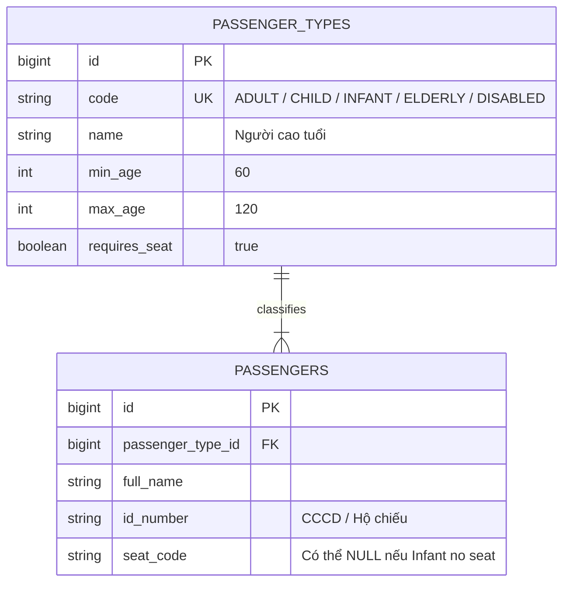

# Nhóm Hành Khách & Chính Sách Vé Em Bé

Mỗi hành khách lên tàu thuộc một Nhóm đối tượng khác nhau với giá vé và quy định ghế ngồi riêng.

---

## 🎯 Bài Toán Nghiệp Vụ

- **Nhóm Khách Ưu Đãi (DEC-019)**: Người lớn, Trẻ em, Em bé, Người cao tuổi (trên 60 tuổi), Người khuyết tật, Cư dân huyện đảo. Công ty có thể tự tạo và cấu hình điều kiện áp dụng cho từng nhóm.
- **Em Bé Có Cần Ghế Riêng Không? (DEC-020)**: Một số chặng bão bùng yêu cầu em bé phải có ghế riêng; chặng ngắn em bé ngồi chung lòng bố mẹ. Hệ thống phải cho phép **Bật/Tắt chính sách Em bé có ghế riêng bằng cấu hình**.

---

## 💡 Giải Pháp Kiến Trúc Backend

- **Passenger Type Dynamic Master Data**: Quản lý nhóm khách trong bảng `passenger_types`.
- **Feature Toggle `infant_seat_required`**:
  - Nếu `FALSE`: Em bé không chiếm vị trí trên sơ đồ ghế, nhưng vẫn lưu thông tin trong danh sách Hành khách (`passengers`) để in Manifest nộp Cảng vụ.
  - Nếu `TRUE`: Em bé được chọn ghế riêng trên sơ đồ như Người lớn.

---

## 🪨 Chi Tiết ERD & Lý Giải TẠI SAO

### 🔍 Lý Giải TẠI SAO (Schema Rationale):
- **Vì sao `seat_code` trong `PASSENGERS` có thể NULL?**: Khi chính sách cấu hình `infant_seat_required = FALSE`, em bé có bản ghi `PASSENGERS` nhưng trường `seat_code = NULL`, không làm giảm số lượng ghế trống khả dụng trên tàu.

---

## 🗿 Grug Đúc Kết

<Callout type="tip">
  **🗿 Grug Kiến Trúc Mách Bảo**: *"Grug bé nhỏ bế trên tay không cần tốn hòn đá ghế! Nhưng tên em bé vẫn phải đục chữ trên bảng đá nộp cho Cảng vụ bến tàu!"*
</Callout>
