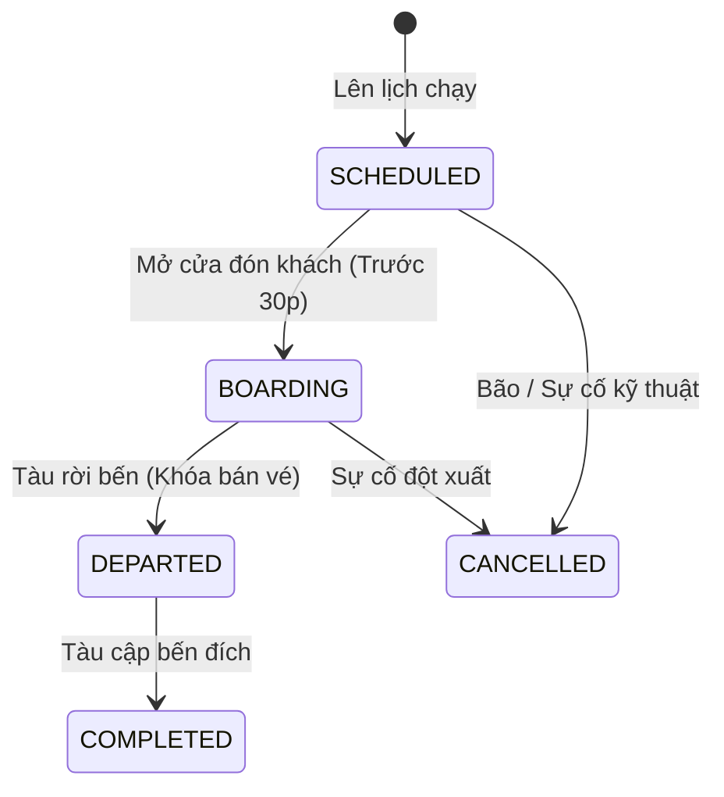
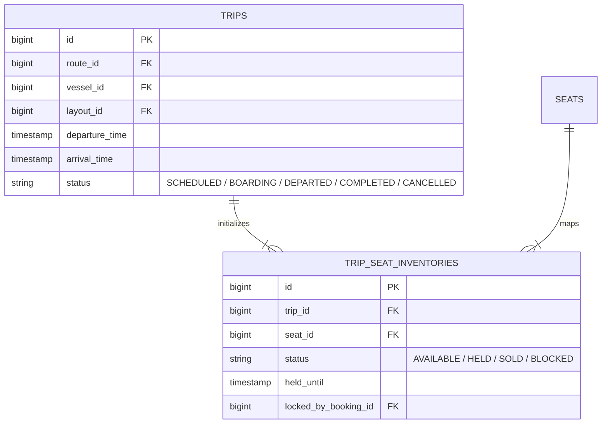

# Vòng Đời Chuyến Tàu & Quản Lý Kho Ghế Chuyến

Mỗi Chuyến tàu (`TRIP`) đại diện cho một hành trình di chuyển cụ thể của một con tàu vào ngày giờ xác định.

---

## 🎯 Bài Toán Nghiệp Vụ

Tàu Superdong I có 275 ghế. Khi mở bán chuyến 8h00 ngày 10/02, hệ thống phải biết chính xác từng vị trí ghế A01, A02... đang ở trạng thái nào: **Khả dụng (AVAILABLE)**, **Đang giữ chỗ (HELD)**, **Đã bán (SOLD)** hay **Khóa kỹ thuật (BLOCKED)**.

---

## 💡 Giải Pháp Kiến Trúc Backend

- **TRIP.status = DEPARTED**: Ngay khi tàu rời bến, hệ thống khóa 100% việc đặt vé mới trên chuyến đó.
- **SSOT Kho Ghế**: Bảng `trip_seat_inventories` là Nguồn chân lý duy nhất (SSOT) cho số lượng ghế còn trống.

---

## 🪨 Chi Tiết ERD & Lý Giải TẠI SAO

### 🔍 Lý Giải TẠI SAO (Schema Rationale):
- **Vì sao `TRIP_SEAT_INVENTORIES` có `locked_by_booking_id` (FK)?**: Để khi một Booking bị hết hạn (`EXPIRED`) hoặc bị hủy, hệ thống chỉ cần tìm đúng các bản ghi inventory có `locked_by_booking_id` đó để giải phóng trạng thái về `AVAILABLE` một cách tức thì.

---

## 🗿 Grug Đúc Kết

<Callout type="tip">
  **🗿 Grug Kiến Trúc Mách Bảo**: *"Thuyền nhổ neo nhấc mỏ neo lên là Grug lập tức đóng hòm phiếu bán vé! Ai chưa lên thuyền thì ở lại bến!"*
</Callout>
