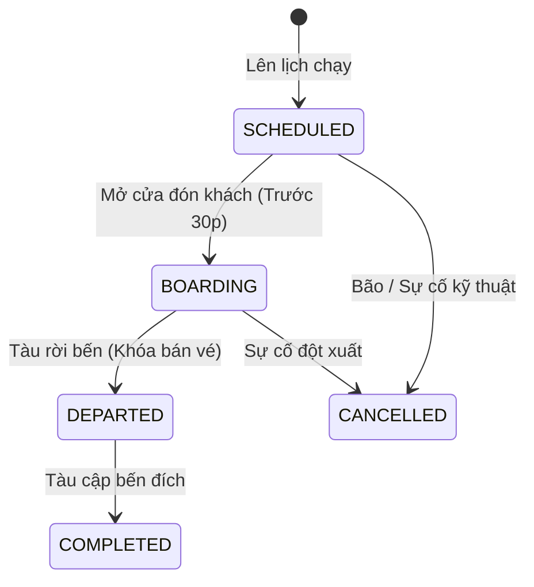
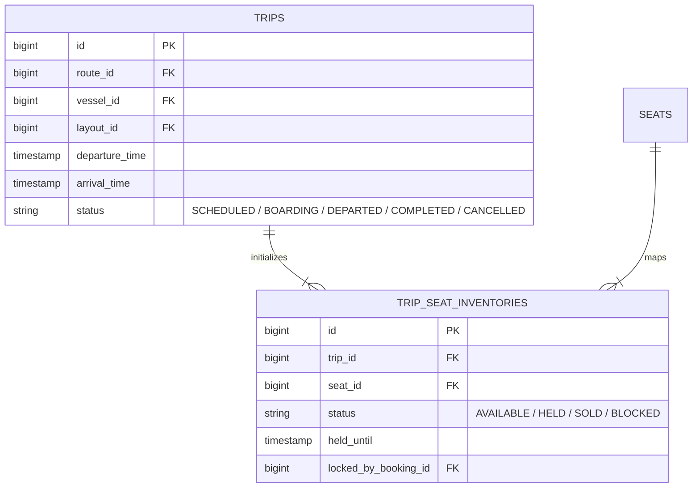

# Vòng Đời Chuyến Tàu & Quản Lý Kho Ghế Chuyến

Mỗi Chuyến tàu (`TRIP`) đại diện cho một hành trình di chuyển cụ thể của một con tàu vào ngày giờ xác định.

---

## 🎯 Bài Toán Nghiệp Vụ

Tàu Superdong I có 275 ghế. Khi mở bán chuyến 8h00 ngày 10/02, hệ thống phải biết chính xác từng vị trí ghế A01, A02... đang ở trạng thái nào: **Khả dụng (AVAILABLE)**, **Đang giữ chỗ (HELD)**, **Đã bán (SOLD)** hay **Khóa kỹ thuật (BLOCKED)**.

---

## 💡 Giải Pháp Kiến Trúc Backend

- **TRIP.status = DEPARTED**: Ngay khi tàu rời bến, hệ thống khóa 100% việc đặt vé mới trên chuyến đó.
- **SSOT Kho Ghế**: Bảng `trip_seat_inventories` là Nguồn chân lý duy nhất (SSOT) cho số lượng ghế còn trống.

---

## 🪨 Chi Tiết ERD & Lý Giải TẠI SAO

### 🔍 Lý Giải TẠI SAO (Schema Rationale):
- **Vì sao `TRIP_SEAT_INVENTORIES` có `locked_by_booking_id` (FK)?**: Để khi một Booking bị hết hạn (`EXPIRED`) hoặc bị hủy, hệ thống chỉ cần tìm đúng các bản ghi inventory có `locked_by_booking_id` đó để giải phóng trạng thái về `AVAILABLE` một cách tức thì.

---

## 📊 Phân Biệt Khái Niệm: JOURNEY vs TRIP vs ROUTE

Để tránh nhầm lẫn khi thiết kế cơ sở dữ liệu và viết mã nguồn Backend, dưới đây là bảng phân định rạch ròi giữa 3 khái niệm cốt lõi:

| Khái Niệm | Bản Chất Kỹ Thuật | Yếu Tố Cấu Thành | Số Lượng Dữ Liệu trong CSDL |
| :--- | :--- | :--- | :--- |
| **`JOURNEY` (Hành Trình)** | **Ý định di chuyển trừu tượng** (Logical Intent) do khách chọn trên trang tìm kiếm. | `origin_location_id` + `destination_location_id` | Rất ít (Ví dụ: Chỉ 1 bản ghi duy nhất đại diện cho chặng `Rạch Giá ➔ Phú Quốc`). |
| **`ROUTE` (Tuyến Đường)** | **Tuyến đường vận tải** kết nối các điểm dừng (`ROUTE_STOPS`). | Bao gồm danh sách các bến dừng trung gian (nếu có). | Cố định theo cấu hình mạng lưới tuyến của Superdong. |
| **`TRIP` (Chuyến Tàu)** | **Lượt chạy thực tế cụ thể** (Physical Execution) của một con tàu vào ngày giờ xác định. | `journey_id` + `vessel_id` + `departure_time` + `arrival_time` + `TRIP_SEAT_INVENTORIES` | Rất nhiều (Mỗi ngày có 5-10 `TRIP` chạy trên cùng 1 `JOURNEY`). |

<Callout type="info">
  **💡 Ví Dụ Thực Tế**: 
  - **`JOURNEY`**: Khách lên web chọn tìm vé **"Rạch Giá đi Phú Quốc"** (Khái niệm tìm kiếm, không ngày giờ, không tên tàu).
  - **`ROUTE`**: Tuyến vận tải đường thủy **Tuyến Rạch Giá - Phú Quốc** (Kết nối Bến Rạch Giá và Cảng Bãi Vòng).
  - **`TRIP`**: Chuyến tàu **Superdong I khởi hành lúc 8h00 ngày 10/02/2026** (Có ngày giờ đi/đến cụ thể, có con tàu vật lý và có kho 275 ghế khả dụng).
</Callout>

---

## 🗿 Grug Đúc Kết

<Callout type="tip">
  **🗿 Grug Kiến Trúc Mách Bảo**: 
  - **`JOURNEY`** = Con đường trên biển nối từ Đất Rạch Giá ra Đảo Phú Quốc (Con đường nằm yên đó muôn đời)!
  - **`TRIP`** = Con tàu Superdong I mở máy chở người chạy trên con đường đó đúng **8 giờ 00 phút sáng hôm nay**!
</Callout>
