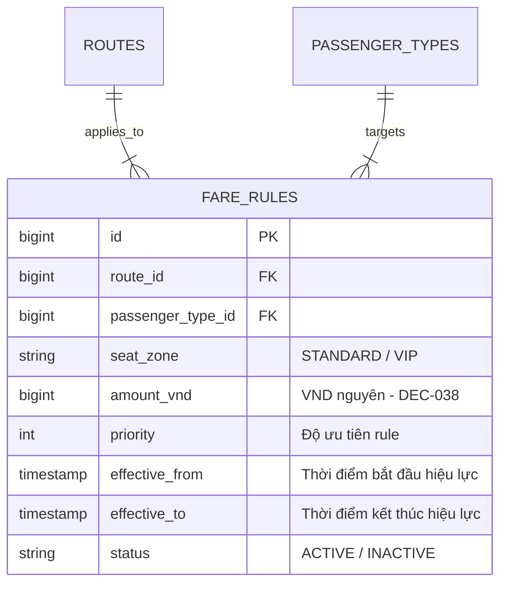

# Động Cơ Tính Giá Vé Linh Hoạt (Dynamic Fare Engine)

Giá vé tàu Superdong được quyết định bởi nhiều trục nghiệp vụ kết hợp với nhau.

---

## 🎯 Bài Toán Nghiệp Vụ (DEC-017)

Giá vé không cố định cho tất cả mọi người. Giá vé cần được **cấu hình linh hoạt tùy chỉnh nhiều nhất có thể** theo các yếu tố:
1. Hành trình / Tuyến đường (`journey_id` / `route_id`).
2. Nhóm hành khách (`passenger_type_id`).
3. Hạng ghế / Khu vực (`seat_zone` / `seat_class`).
4. Khoảng thời gian hiệu lực (`effective_from` đến `effective_to`).

---

## 💡 Giải Pháp Kiến Trúc Backend

Hệ thống xây dựng **Fare Engine** dựa trên bảng quy tắc `fare_rules` (thuộc Container `BookingSection/Pricing`). Khi khách đặt vé, Quote Service sẽ thực hiện ghép nối các điều kiện (Pattern Matching) để tìm ra quy tắc giá có độ ưu tiên (`priority`) phù hợp nhất.

<Callout type="warn">
  **🧮 Công Thức Tính Giá Vé Dynamic (Dynamic Fare Formula)**:
  
  **`Giá Vé Cuối Cùng`** = (**`Giá Cơ Bản`** × **`Hệ Số Nhóm Khách`**) + **`Phụ Phí Hạng VIP`** + **`Phụ Phí Dịp Lễ/Tết`**
</Callout>

---

## 🪨 Chi Tiết ERD & Lý Giải TẠI SAO

### 🔍 Lý Giải TẠI SAO (Schema Rationale):
- **Vì sao có `effective_from` và `effective_to`?**: Xác định khoảng thời gian có hiệu lực của `fare_rules`. Mức giá cụ thể, khoảng thời gian áp dụng và tiêu chí xác định hiệu lực (so sánh với `booking.created_at` hay `trip.departure_at`) do Superdong cấu hình. Tài liệu hiện chưa chốt mức giá hay con số tăng cụ thể.

---

## 🗿 Grug Đúc Kết

<Callout type="tip">
  **🗿 Grug Kiến Trúc Mách Bảo**: *"Ghế VIP ngồi êm hơn tốn thêm sò! Tù trưởng tính giá tự động ghép bảng quy tắc `fare_rules`, không nhẩm tay!"*
</Callout>
