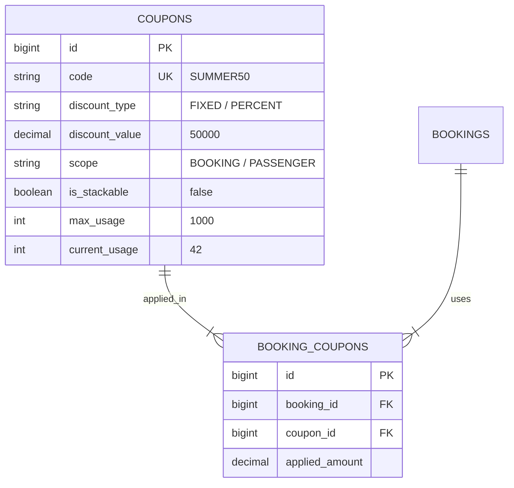

# Quản Lý Coupon & Quy Tắc Cộng Dồn

Mã giảm giá (Coupon) là công cụ kích cầu đặt vé trực tuyến trên hệ thống Superdong.

---

## 🎯 Bài Toán Nghiệp Vụ

- **Cấu hình độc lập trên từng Coupon (DEC-023)**: Khách có mã `SUMMER50` (giảm 50k) và `VIPMEMBER` (giảm 10%). Mã `SUMMER50` cho phép cộng dồn với mã khác, nhưng `VIPMEMBER` quy định chỉ được dùng riêng biệt.
- **Phạm vi áp dụng (DEC-021)**: Khuyến mãi có thể áp dụng cho **Toàn bộ Đơn hàng (Booking)** hoặc áp dụng riêng cho **Từng hành khách (Passenger)**.

---

## 💡 Giải Pháp Kiến Trúc Backend

Quote Engine thực hiện kiểm tra 3 bước trước khi trừ tiền:
1. **Validation Gate**: Hạn sử dụng, Số lượt dùng còn lại, Giá trị đơn tối thiểu.
2. **Stacking Rule Check**: Nếu Đơn đã có Mã A, mà Mã B nhập vào có `is_stackable = FALSE` -> Từ chối mã B.
3. **Scope Application**:
   - `scope = BOOKING`: Trừ thẳng vào `grand_total`.
   - `scope = PASSENGER`: Trừ tiền trên từng dòng `passengers`.

---

## 🪨 Chi Tiết ERD & Lý Giải TẠI SAO

### 🔍 Lý Giải TẠI SAO (Schema Rationale):
- **Vì sao có bảng `BOOKING_COUPONS` trung gian?**: Vì nếu một đơn cho phép cộng dồn nhiều Coupon, bảng trung gian này lưu chính xác từng Coupon đã áp dụng kèm số tiền được giảm tương ứng của từng mã để phục vụ đối soát kế toán.

---

## 🗿 Grug Đúc Kết

<Callout type="tip">
  **🗿 Grug Kiến Trúc Mách Bảo**: *"Thẻ bớt sò nào ghi chữ cho phép đi chung thì Grug gộp lại! Thẻ nào ghi độc quyền thì chỉ được dùng 1 thẻ!"*
</Callout>
