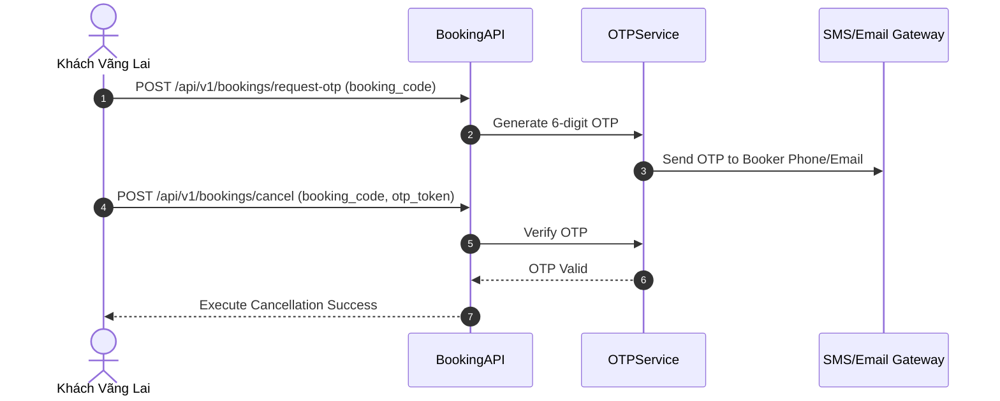
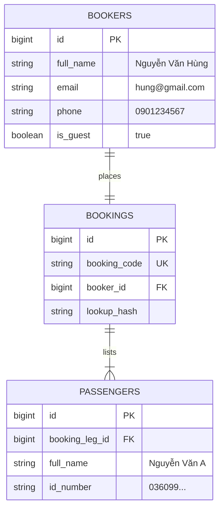

# Phân Định Booker, Passenger & OTP Khách Vãng Lai

Hệ thống Superdong phân định rạch ròi giữa người thực hiện giao dịch thanh toán và người thực tế ngồi trên tàu.

---

## 🎯 Bài Toán Nghiệp Vụ

1. **Booker vs Passenger (DEC-040)**: Anh Hùng mua vé cho gia đình 4 người. Anh Hùng là `BOOKER` (quản lý đơn, có quyền đổi/hủy). 3 người còn lại là `PASSENGER` (chỉ được xem vé của chính mình để lên tàu).
2. **Khách Vãng Lai Không Đăng Nhập (DEC-026, DEC-027)**: Đặt vé cực kỳ thuận tiện, không bắt tạo tài khoản. Hệ thống gửi link tra cứu bảo mật qua Email/SMS.
3. **Bảo Mật OTP Thao Tác Nhạy Cảm (DEC-035)**: Khách vãng lai muốn đổi ngày đi, sửa SĐT hoặc hủy vé -> **Bắt buộc phải nhập OTP xác minh** gửi về SĐT/Email lúc đặt.

---

## 💡 Giải Pháp Kiến Trúc Backend

- **Guest Security Hash**: Đơn vãng lai lưu token `lookup_hash = SHA256(booking_code + secret_key)`.
- **OTP Verification Flow**:

---

## 🪨 Chi Tiết ERD & Lý Giải TẠI SAO

### 🔍 Lý Giải TẠI SAO (Schema Rationale):
- **Vì sao tách `BOOKERS` riêng khỏi `PASSENGERS`?**: Booker có thể không đi cùng tàu (ví dụ: Công ty đặt vé cho nhân viên đi công tác). Tách `BOOKERS` giúp quản lý thông tin xuất hóa đơn và liên hệ hoàn toàn độc lập với danh sách đi tàu.

---

## 🗿 Grug Đúc Kết

<Callout type="tip">
  **🗿 Grug Kiến Trúc Mách Bảo**: *"Người trả tiền sò (Booker) nắm chìa khóa đơn! Muốn sửa thông tin hay trả vé thì chim bồ câu OTP phải gật đầu mới được làm!"*
</Callout>
