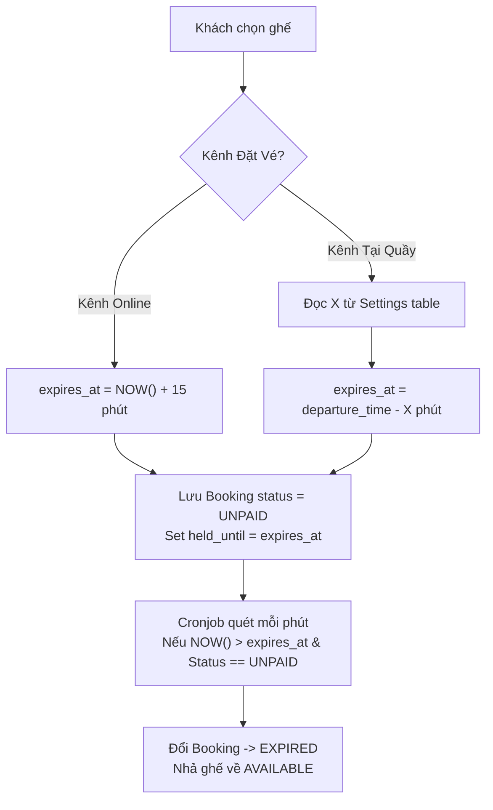
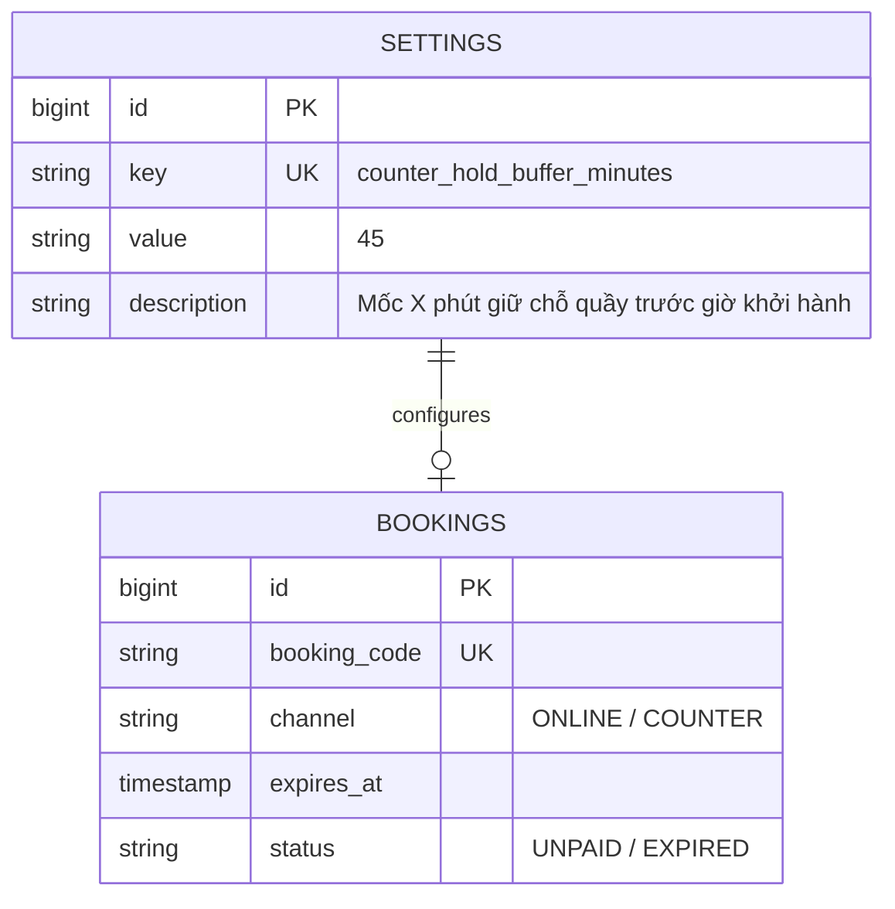

# Luồng Giữ Ghế Online (15 Phút) vs Giữ Ghế Quầy

Mỗi kênh bán vé áp dụng quy tắc tính thời gian hết hạn giữ ghế (`expires_at`) hoàn toàn khác nhau để tránh treo ghế.

---

## 🎯 Bài Toán Nghiệp Vụ

1. **Giữ Ghế Online**: Khách chọn ghế A12 trên web và chuyển sang cổng VNPAY. Ghế phải được giữ trong đúng **15 phút**. Quá 15 phút chưa trả tiền -> Tự hủy đơn và nhả ghế.
2. **Giữ Ghế Tại Quầy (DEC-009, DEC-010)**: Khách đến quầy chọn vé hoặc gọi điện đặt giữ chỗ trước. Ghế được giữ theo mốc thời gian trước giờ khởi hành:

<Callout type="info">
  **⏱️ Công Thức Giữ Ghế Thanh Toán Tại Quầy (Counter Hold Formula)**:
  
  **`expires_at`** = **`departure_time`** − **`X phút`**
</Callout>

- **Quy tắc vàng (DEC-010)**: Giá trị `X` được quản lý trong **Cấu hình (Settings)**, tuyệt đối **KHÔNG viết cứng (hardcode)** 30 hay 60 phút trong mã nguồn!

---

## 💡 Giải Pháp Kiến Trúc Backend

---

## 🪨 Chi Tiết ERD & Lý Giải TẠI SAO

### 🔍 Lý Giải TẠI SAO (Schema Rationale):
- **Vì sao `expires_at` lưu trực tiếp trên bảng `BOOKINGS`?**: Để Cronjob quét tìm các đơn hết hạn cực nhanh bằng câu lệnh SQL `WHERE status = 'UNPAID' AND expires_at <= NOW()` có đánh Index, giúp giải phóng ghế hàng ngàn đơn cùng lúc mà không làm treo hệ thống.

---

## 🗿 Grug Đúc Kết

<Callout type="tip">
  **🗿 Grug Kiến Trúc Mách Bảo**: *"Đặt trên mạng thì đếm lùi 15 phút! Đặt tại quầy bến tàu thì cắm cọc trước giờ thuyền chạy X phút! Quá giờ chưa trả tiền sò là Grug nhả ghế!"*
</Callout>
