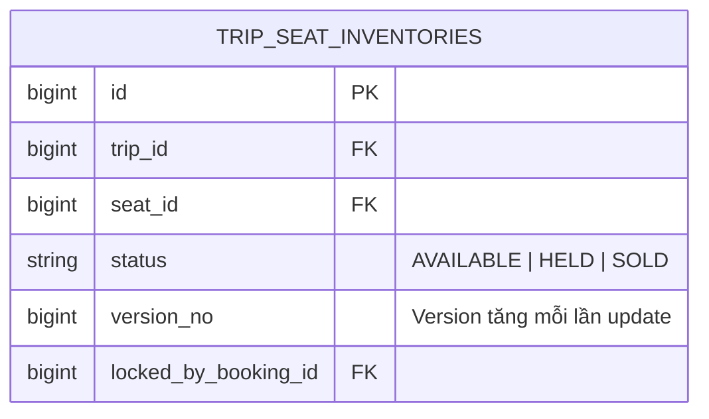

# Thuật Toán Chống Bán Trùng Ghế (MySQL Lock & Optimistic Lock)

Chống bán trùng ghế là **yêu cầu sống còn** của hệ thống đặt vé tàu Superdong.

---

## 🎯 Bài Toán Nghiệp Vụ

Vào lúc 8h00:00 sáng mở bán vé Tết, 1,000 khách hàng cùng lúc bấm nút chọn ghế **A12** trên chuyến Rạch Giá - Phú Quốc 9h00. Nếu Backend không có cơ chế khóa phân tán và cô lập giao dịch, ghế A12 sẽ bị bán cho 2 hoặc 3 người cùng một lúc (Double Booking).

---

## 💡 Giải Pháp Kiến Trúc Backend (Laravel & MySQL)

Hệ thống kết hợp 2 tầng khóa MySQL an toàn tuyệt đối trong Laravel:

1. **Tầng 1: MySQL Pessimistic Lock (`SELECT ... FOR UPDATE`)**:
   - Khi giữ ghế, Backend thực hiện truy vấn `TripSeatInventory::where('trip_id', $tripId)->where('seat_id', $seatId)->lockForUpdate()->first()`.
   - MySQL sẽ khóa dòng dữ liệu ghế đó trong suốt thời gian diễn ra `DB::transaction()`. Chỉ duy nhất **1 Request đầu tiên** cập nhật được trạng thái từ `AVAILABLE` sang `HELD`. 999 Request đến sau sẽ thấy ghế đã bị đổi trạng thái hoặc phải chờ khóa giải phóng.

2. **Tầng 2: Database Optimistic Locking (Khóa lạc quan bằng Version)**:
   - Khi ghi dữ liệu vào MySQL, SQL kiểm tra `UPDATE trip_seat_inventories SET status = 'HELD', version_no = version_no + 1 WHERE id = 100 AND status = 'AVAILABLE' AND version_no = 5`.
   - Nếu `affected_rows == 0`, giao dịch bị hủy bỏ (Rollback).

---

## 🪨 Chi Tiết ERD & Lý Giải TẠI SAO

### 🔍 Lý Giải TẠI SAO (Schema Rationale):
- **Vì sao dùng `lockForUpdate()` kết hợp `version_no` trong MySQL?**: Vì MySQL InnoDB hỗ trợ Row-Level Locking (Khóa cấp dòng). Khi bọc trong `DB::transaction()`, InnoDB đảm bảo tính nguyên tố ACIDs 100%, không bị lọt dữ liệu bán trùng ghế ngay cả khi chạy nhiều worker Laravel.

---

## 🗿 Grug Đúc Kết

<Callout type="tip">
  **🗿 Grug Kiến Trúc Mách Bảo**: *"Búa khóa MySQL lockForUpdate gõ xuống dòng ghế A12! Người đầu tiên giữ chỗ thành công thì 999 người đến sau tự động lùi bước!"*
</Callout>
