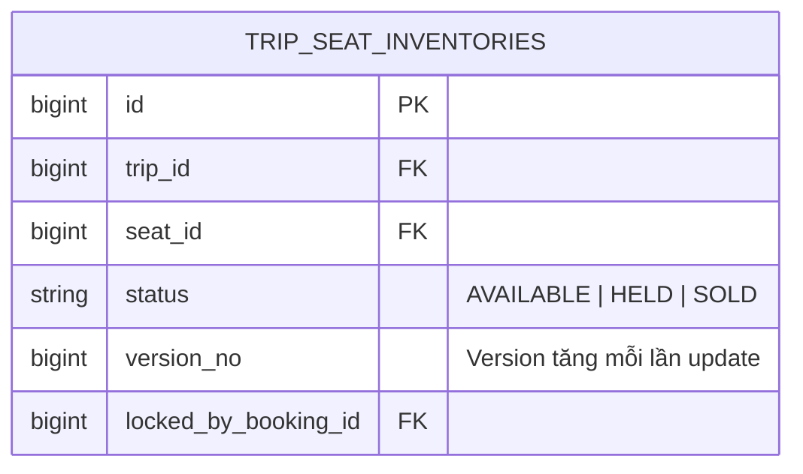

# Thuật Toán Chống Bán Trùng Ghế (Redis Lock & Optimistic Lock)

Chống bán trùng ghế là **yêu cầu sống còn** của hệ thống đặt vé tàu Superdong.

---

## 🎯 Bài Toán Nghiệp Vụ

Vào lúc 8h00:00 sáng mở bán vé Tết, 1,000 khách hàng cùng lúc bấm nút chọn ghế **A12** trên chuyến Rạch Giá - Phú Quốc 9h00. Nếu Backend không có cơ chế khóa phân tán, ghế A12 sẽ bị bán cho 2 hoặc 3 người cùng một lúc (Double Booking).

---

## 💡 Giải Pháp Kiến Trúc Backend

Hệ thống kết hợp 2 tầng khóa an toàn tuyệt đối:

1. **Tầng 1: Redis Distributed Lock (Khóa phân tán tốc độ cao)**:
   - Trước khi giữ ghế, Backend thực hiện lấy lock key `lock:trip:{trip_id}:seat:{seat_id}` trên Redis với TTL 5 giây.
   - Chỉ duy nhất **1 Request đầu tiên** lấy được lock thành công. 999 Request đến sau bị từ chối ngay lập tức với lỗi `409 Conflict (Ghế đang được xử lý)`.

2. **Tầng 2: Database Optimistic Locking (Khóa lạc quan bằng Version)**:
   - Khi ghi dữ liệu vào PostgreSQL, SQL kiểm tra `UPDATE trip_seat_inventories SET status = 'HELD', version_no = version_no + 1 WHERE id = 100 AND status = 'AVAILABLE' AND version_no = 5`.
   - Nếu `affected_rows == 0`, giao dịch bị hủy bỏ (Rollback).

---

## 🪨 Chi Tiết ERD & Lý Giải TẠI SAO

### 🔍 Lý Giải TẠI SAO (Schema Rationale):
- **Vì sao phải dùng Redis Lock trước khi gọi Database?**: Truy vấn Database tốn I/O. Với 1,000 req/s, đẩy tất cả vào Database sẽ gây nghẽn Connection Pool (Deadlock). Redis Lock ngăn 99.9% request thừa ngay trên tầng Memory trước khi chạm tới DB!

---

## 🗿 Grug Đúc Kết

<Callout type="tip">
  **🗿 Grug Kiến Trúc Mách Bảo**: *"Hòn đá khóa màu đỏ Redis chặn ngoài cửa hang! Ai chạy nhanh nhất chộp được khóa đỏ thì mới được đục tên lên ghế A12!"*
</Callout>
