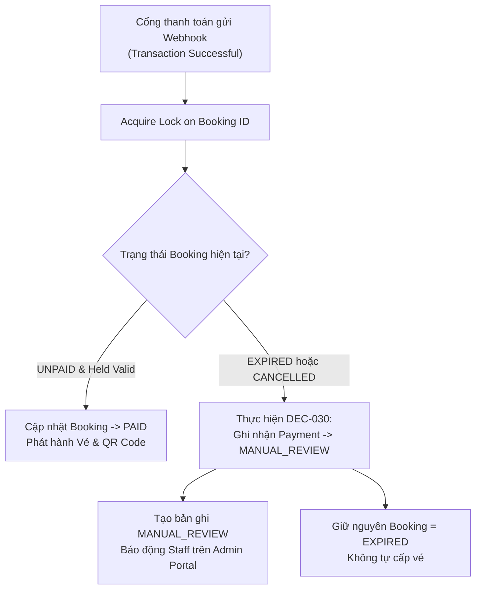
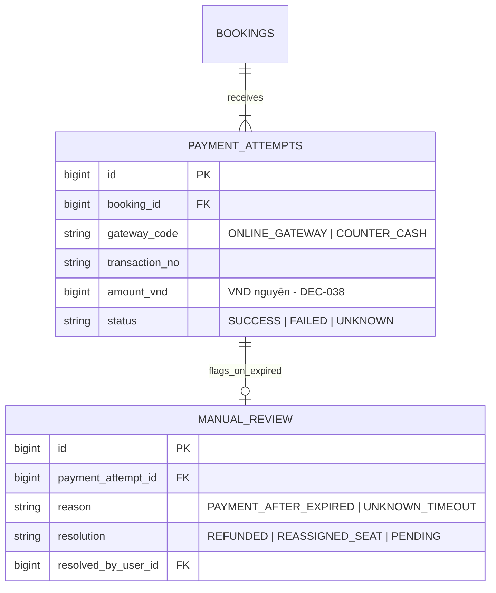

# Payment Webhook & Xử Lý Giao Dịch Quá Hạn

Tích hợp Cổng thanh toán trực tuyến (tích hợp qua Adapter) là luồng xử lý bất đồng bộ (Asynchronous Webhook).

---

## 🎯 Bài Toán Nghiệp Vụ & Quyết Định Sếp Hiếu (DEC-030, DEC-031)

1. **Thanh toán thành công SAU KHI đơn đã bị hủy hết hạn (DEC-030)**: Khách thực hiện chuyển tiền qua Cổng thanh toán lúc 14:59, nhưng nghẽn mạng đến 15:05 Cổng mới gửi Webhook báo thành công. Lúc 15:00, Cronjob ở Backend đã nhả ghế và hủy đơn `EXPIRED`!
   - **Xử lý (DEC-030)**: **KHÔNG tự động khôi phục Booking hay phát hành vé**! Giao dịch được chuyển sang bảng `MANUAL_REVIEW` ở trạng thái chờ Staff xử lý đối soát thủ công (hoàn tiền hoặc xếp ghế mới).
2. **Trạng thái UNKNOWN (DEC-031)**: Nếu cổng thanh toán trả về trạng thái chưa rõ kết quả (`UNKNOWN`), **khóa không cho khách tạo Payment mới** cho Booking đó cho tới khi hoàn tất đối soát.

---

## 💡 Giải Pháp Kiến Trúc Backend

---

## 🪨 Chi Tiết ERD & Lý Giải TẠI SAO

### 🔍 Lý Giải TẠI SAO (Schema Rationale):
- **Vì sao có bảng `MANUAL_REVIEW`?**: Để tiền của khách không bao giờ bị rơi vào "khoảng không vô hình". Mọi giao dịch lỗi nhịp mạng đều được đưa vào hàng chờ đối soát thủ công với đầy đủ Audit Trail.

---

## 🗿 Grug Đúc Kết

<Callout type="tip">
  **🗿 Grug Kiến Trúc Mách Bảo**: *"Tiền về muộn khi ghế đã nhả cho người khác thì Grug cất tiền vào rương đối soát MANUAL_REVIEW! Không tự tiện in vé trùng cho 2 người!"*
</Callout>
