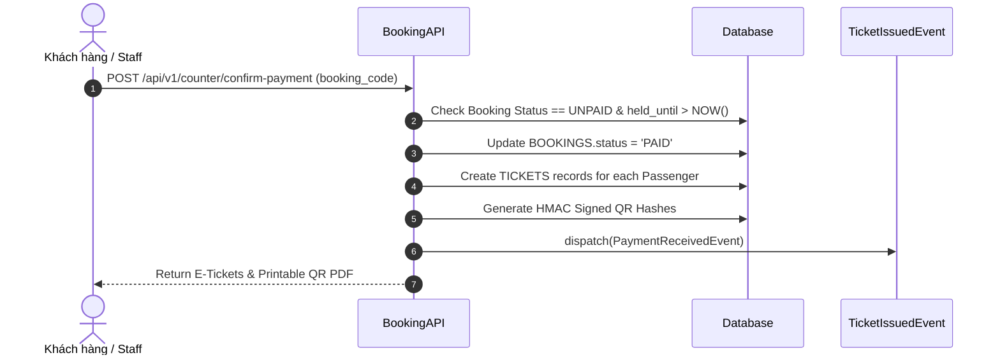
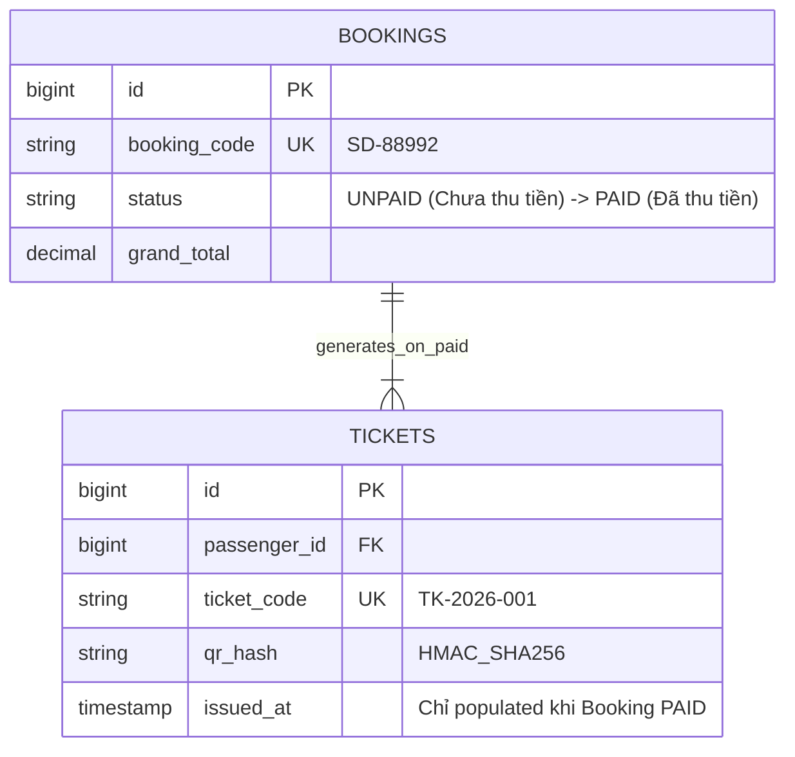

# Thanh Toán Tại Quầy & Quy Trình Phát Hành Vé

Đặt vé và thanh toán tại quầy tuân thủ chặt chẽ 3 quyết định cốt lõi của sếp Hùng.

---

## 🎯 Bài Toán Nghiệp Vụ (DEC-006, DEC-007, DEC-008)

1. **Chưa thu tiền = Chưa có Vé & QR (DEC-006, DEC-007)**: Khách chọn "Thanh toán tại quầy" trên web hoặc đặt giữ chỗ qua điện thoại -> Hệ thống chỉ cấp **Mã đặt chỗ (Booking Code)** ở trạng thái chưa thanh toán. **Hoàn toàn KHÔNG phát hành vé điện tử và KHÔNG có mã QR hợp lệ**.
2. **Xác nhận thu tiền -> Phát hành Vé & QR (DEC-008)**: Khi khách đến quầy đưa tiền mặt/quẹt thẻ, Nhân viên bấm nút "Xác nhận đã thu tiền" -> Hệ thống mới phát hành Vé điện tử (`TICKETS`) và Mã QR để lên tàu.

---

## 💡 Giải Pháp Kiến Trúc Backend

---

## 🪨 Chi Tiết ERD & Lý Giải TẠI SAO

### 🔍 Lý Giải TẠI SAO (Schema Rationale):
- **Vì sao không tạo bản ghi `TICKETS` trước ở trạng thái `INACTIVE`?**: Để đảm bảo nguyên tắc bất biến (INV-003): *"Ticket chỉ được khởi tạo khi Booking đã thanh toán"*. Điều này loại bỏ hoàn toàn rủi ro rò rỉ mã QR giả lên tàu.

---

## 🗿 Grug Đúc Kết

<Callout type="tip">
  **🗿 Grug Kiến Trúc Mách Bảo**: *"Đưa vỏ sò tiền mặt cho tù trưởng phòng vé! Nhận đủ tiền thì hòn đá QR mới được khắc hình phát sáng!"*
</Callout>
