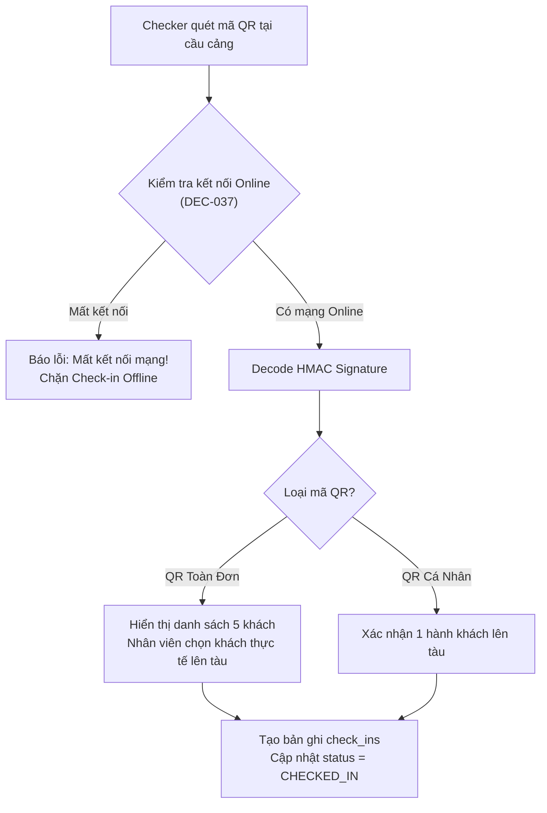
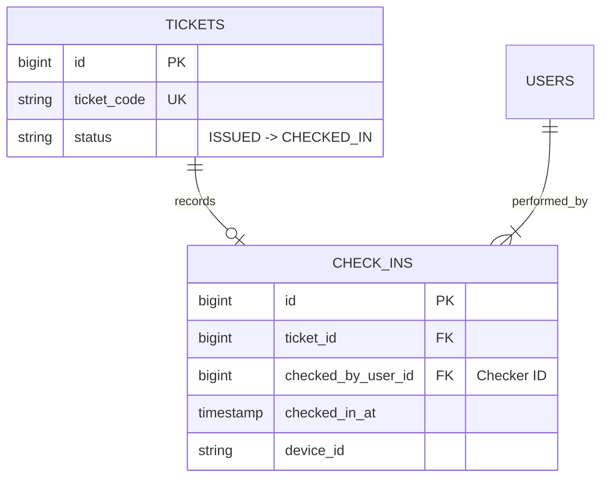

# Mã QR Check-in & Quy Tắc Không Check-in Offline

Kiểm soát hành khách lên tàu tại cầu cảng thông qua thiết bị quét mã QR chuyên dụng.

---

## 🎯 Bài Toán Nghiệp Vụ & Quyết Định (DEC-022, DEC-037)

1. **Check-in Đoàn vs Check-in Lẻ (DEC-022)**: Hệ thống hỗ trợ cả 2 hình thức:
   - **QR Toàn Đơn**: 1 mã QR cho cả gia đình 5 người. Quét 1 lần check-in toàn bộ hoặc nhân viên chọn những người thực tế lên tàu.
   - **QR Cá Nhân**: Mỗi hành khách có 1 QR riêng biệt trên vé điện tử.
2. **Cấm Check-in Offline Trong MVP (DEC-037)**: MVP không hỗ trợ Check-in Offline. Khi mất kết nối mạng tại cảng, thiết bị quét không ghi nhận check-in local để tránh sai lệch danh sách Manifest nộp Cảng vụ.

---

## 💡 Giải Pháp Kiến Trúc Backend

Mã QR được ký bằng chữ ký số HMAC-SHA256: `payload = booking_code:ticket_code:timestamp:signature`.

---

## 🪨 Chi Tiết ERD & Lý Giải TẠI SAO

### 🔍 Lý Giải TẠI SAO (Schema Rationale):
- **Vì sao có `device_id` và `checked_by_user_id` trong `CHECK_INS`?**: Phục vụ công tác an ninh hàng hải và Audit Log. Nếu có sự cố hành khách lên sai tàu, quản lý biết chính xác nhân viên nào và máy quét nào đã thực hiện lệnh check-in đó.

---

## 🗿 Grug Đúc Kết

<Callout type="tip">
  **🗿 Grug Kiến Trúc Mách Bảo**: *"Kính búp phóng to QR của bảo vệ cảng phải cắm dây mạng trực tiếp! Mất mạng là dừng quét, không đoán mò!"*
</Callout>
