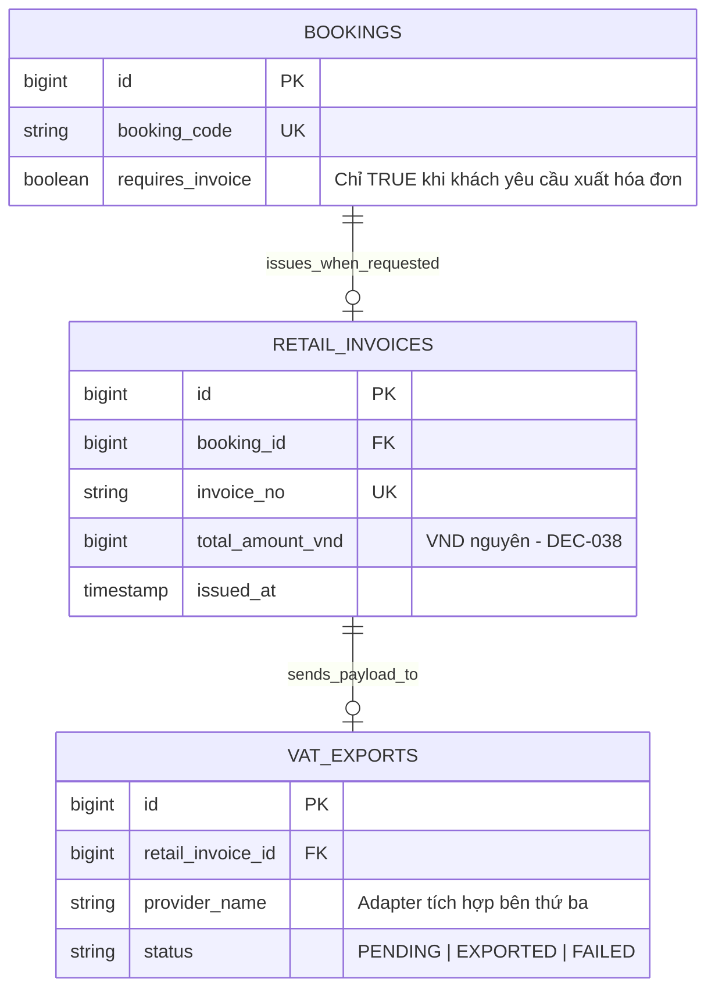

# Hóa Đơn Bán Lẻ & Dữ Liệu VAT (DEC-024, DEC-025)

Hệ thống Superdong hỗ trợ quản lý hóa đơn bán lẻ và chuẩn bị dữ liệu xuất hóa đơn VAT theo đúng các quyết định nghiệp vụ.

---

## 🎯 Bài Toán Nghiệp Vụ & Quyết Định (DEC-024, DEC-025)

1. **Phát Hành Hóa Đơn Bán Lẻ Theo Yêu Cầu (DEC-025)**:
   - Hóa đơn bán lẻ được phát hành **khi Booking có ghi nhận yêu cầu xuất hóa đơn** (workflow:1838-1839). Không tự động sinh cho 100% Booking nếu khách không có nhu cầu.
2. **Xuất Hóa Đơn VAT Qua Hệ Thống Bên Ngoài (DEC-024)**:
   - Hệ thống Superdong không tự xây module VAT nội bộ. Hóa đơn VAT điện tử được phát hành qua Cổng kết nối tích hợp hệ thống bên ngoài (Ví dụ: Provider tích hợp qua Adapter, nằm ngoài phạm vi MVP - workflow:3459).

---

## 💡 Luồng Xử Lý Hóa Đơn Bán Lẻ & VAT

- **Retail Invoice Generation**: Ngay khi Booking chuyển trạng thái `PAID` VÀ có gắn flag `requires_invoice = true`, sinh mã `invoice_no` nội bộ và xuất file Hóa đơn bán lẻ.
- **VAT Integration Queue**: Đẩy message `ExportVATInvoiceJob` vào Laravel Database Queue (`queue:work`) để kết nối Adapter phát hành hóa đơn VAT bên thứ ba.

---

## 🪨 Chi Tiết ERD & Lý Giải TẠI SAO

### 🔍 Lý Giải TẠI SAO (Schema Rationale):
- **Vì sao tách `RETAIL_INVOICES` khỏi `BOOKINGS`?**: Để đảm bảo nguyên tắc phân rã Single Responsibility. Không phình to bảng `BOOKINGS` với các thông tin MST, Địa chỉ công ty xuất hóa đơn.

---

## 🗿 Grug Đúc Kết

<Callout type="tip">
  **🗿 Grug Kiến Trúc Mách Bảo**: *"Ai cần tờ giấy hóa đơn thì máy mới in! Tiền vé đóng xong, máy đẩy tin nhắn qua đường dây cho bên thuế làm hóa đơn đỏ!"*
</Callout>
