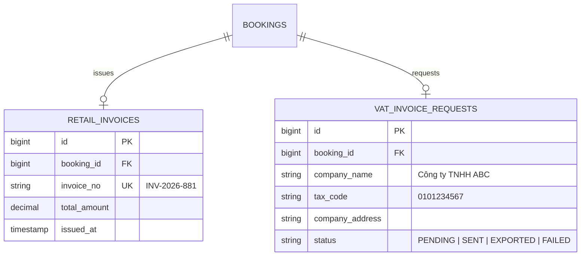

# Xuất Hóa Đơn Bán Lẻ & Dữ Liệu Hóa Đơn VAT

Quản lý chứng từ tài chính và nghĩa vụ thuế đối với từng Booking.

---

## 🎯 Bài Toán Nghiệp Vụ (DEC-024, DEC-025)

1. **Hóa Đơn Bán Lẻ Nội Bộ (DEC-025)**: Hệ thống mới hỗ trợ quản lý và in **Hóa đơn bán lẻ (Retail Invoice)** trực tiếp cho khách hàng mua vé tại quầy hoặc tải file PDF trên website.
2. **Xuất Hóa Đơn VAT Qua Hệ Thống Bên Ngoài (DEC-024)**: Hóa đơn GTGT (VAT) được phát hành qua phần mềm hóa đơn điện tử bên ngoài (như Viettel S-Invoice / VNPT Invoice). Hệ thống mới lưu trữ thông tin công ty, MST và đẩy dữ liệu qua API/Queue tích hợp.

---

## 💡 Giải Pháp Kiến Trúc Backend

- **Retail Invoice Generation**: Ngay khi Booking chuyển trạng thái `PAID`, sinh mã `invoice_no` nội bộ và file PDF Hóa đơn bán lẻ.
- **VAT Integration Queue**: Đẩy message `ExportVATInvoiceJob` vào RabbitMQ / Redis Queue để bên thứ ba phát hành hóa đơn VAT điện tử.

---

## 🪨 Chi Tiết ERD & Lý Giải TẠI SAO

### 🔍 Lý Giải TẠI SAO (Schema Rationale):
- **Vì sao tách `RETAIL_INVOICES` và `VAT_INVOICE_REQUESTS`?**: Hóa đơn bán lẻ được xuất tự động 100% cho mọi Booking thanh toán thành công. Trong khi Hóa đơn VAT chỉ phát sinh khi khách hàng chủ động tích chọn yêu cầu và nhập thông tin MST công ty.

---

## 🗿 Grug Đúc Kết

<Callout type="tip">
  **🗿 Grug Kiến Trúc Mách Bảo**: *"Hóa đơn bán lẻ Grug tự in ngay tại quầy! Hóa đơn VAT thuế nhà nước thì gửi qua con cú đưa thư cho phần mềm bên ngoài!"*
</Callout>
