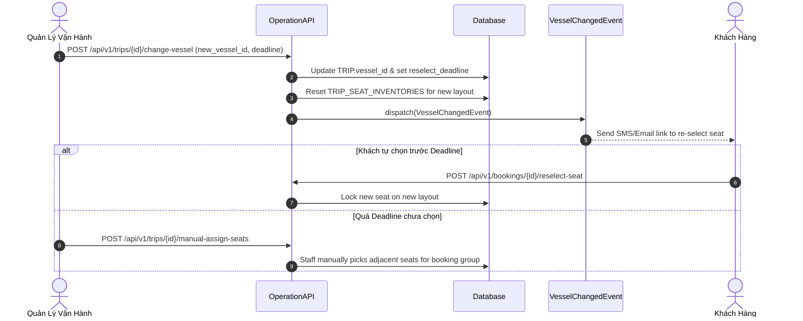
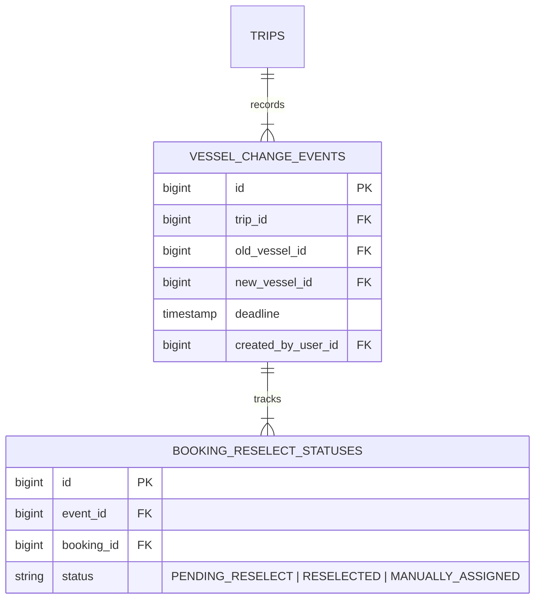

# Xử Lý Biến Cố Đổi Tàu Khác Sơ Đồ Ghế

Khi con tàu đã phân công bị hỏng hóc kỹ thuật, vận hành phải thay thế bằng một tàu khác có sơ đồ ghế hoàn toàn khác.

---

## 🎯 Bài Toán Nghiệp Vụ & Quyết Định Sếp Hùng (DEC-002 -> DEC-005)

1. **Khách được tự chọn lại ghế (DEC-002)**: Đơn hàng và vé giữ nguyên. Hệ thống gửi thông báo kèm link portal để khách tự chọn lại vị trí ghế trên sơ đồ tàu mới.
2. **Không tự động ánh xạ ghế (DEC-002, DEC-003)**: **KHÔNG viết thuật toán tự động đổi mã ghế cũ sang mã ghế mới** (ví dụ: ghế A12 tàu cũ không tự biến thành A12 tàu mới).
3. **Thiết lập Hạn chót & Gán ghế thủ công (DEC-003, DEC-005)**: Người thực hiện đổi tàu nhập mốc **Hạn chót (Reselect Deadline)**. Nếu quá hạn mà khách chưa chọn, Nhân viên phòng vé gán ghế thủ công trên sơ đồ tàu mới.
4. **Ưu tiên gia đình ngồi gần nhau (DEC-004)**: Ưu tiên các hành khách trong cùng 1 Booking được ngồi gần nhau. **MVP chưa làm thuật toán tự động xếp gia đình, Staff thao tác chọn thủ công**.

---

## 💡 Giải Pháp Kiến Trúc Backend

---

## 🪨 Chi Tiết ERD & Lý Giải TẠI SAO

### 🔍 Lý Giải TẠI SAO (Schema Rationale):
- **Vì sao có `BOOKING_RESELECT_STATUSES`?**: Để Staff trên màn hình Admin lọc chính xác những Booking nào đã tự chọn lại ghế thành công, và những Booking nào đã chạm `deadline` mà chưa chọn ghế để tiến hành gán chỗ thủ công.

---

## 🗿 Grug Đúc Kết

<Callout type="tip">
  **🗿 Grug Kiến Trúc Mách Bảo**: *"Thuyền hỏng đổi thuyền mới! Dân làng được tự chọn lại chỗ ngồi trước giờ G! Quá giờ G thì tù trưởng phòng vé xếp chỗ cho cả nhà ngồi cạnh nhau!"*
</Callout>
