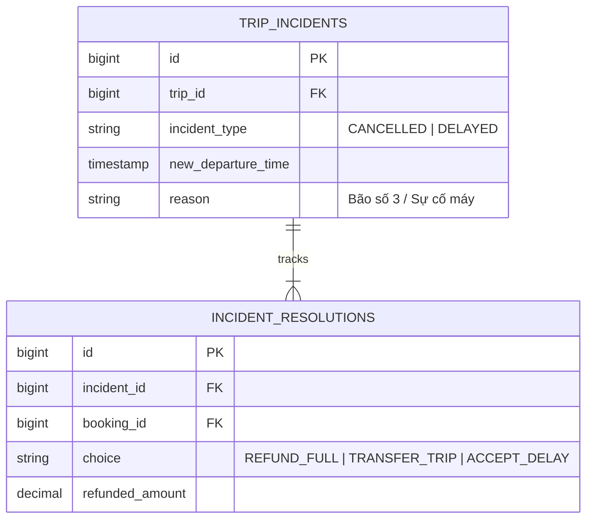

# Superdong Hủy Chuyến Hoặc Thay Đổi Giờ Chạy

Do điều kiện thời tiết biển hoặc lệnh từ Cảng vụ, Superdong có thể phải Hủy chuyến hoặc Đổi giờ xuất bến.

---

## 🎯 Bài Toán Nghiệp Vụ & Quyết Định Sếp Hùng (DEC-011, DEC-012, DEC-013)

1. **Superdong Hủy Chuyến (DEC-011)**: Hệ thống gửi thông báo cho khách hàng. Khách được quyền **lựa chọn giữa 2 phương án**:
   - Hoàn 100% toàn bộ tiền.
   - Hoặc đổi vé miễn phí sang một chuyến tàu khác còn trống chỗ.
2. **Superdong Thay Đổi Giờ Chạy (DEC-012, DEC-013)**:
   - Hệ thống giữ nguyên vé và vị trí ghế cũ, phát thông báo giờ khởi hành mới cho toàn bộ khách hàng (DEC-012).
   - Khách **không đồng ý** với giờ khởi hành mới -> Được quyền chọn chuyển sang chuyến khác hoặc hoàn 100% tiền (DEC-013).

---

## 💡 Giải Pháp Kiến Trúc Backend


```mermaid
flowchart TD
    Incident["Sự cố: Hủy chuyến hoặc Đổi giờ chạy"] --> CheckType{"Loại sự cố?"}
    
    CheckType -->|Hủy Chuyến (DEC-011)| CancelFlow["Cập nhật TRIP.status = CANCELLED<br/>Gửi SMS/Email thông báo khẩn"]
    CheckType -->|Đổi Giờ (DEC-012)| DelayFlow["Cập nhật TRIP.departure_time mới<br/>Giữ nguyên Vé & Ghế<br/>Gửi thông báo giờ mới"]
    
    CancelFlow --> CustomerOption1["Portal cho khách chọn:<br/>1. Hoàn 100% tiền<br/>2. Đổi sang chuyến khác"]
    DelayFlow --> CustomerOption2{"Khách đồng ý giờ mới?"}
    
    CustomerOption2 -->|Đồng ý| KeepTicket["Khách đi tàu giờ mới bình thường"]
    CustomerOption2 -->|Không đồng ý (DEC-013)| CustomerOption1
```

---

## 🪨 Chi Tiết ERD & Lý Giải TẠI SAO



### 🔍 Lý Giải TẠI SAO (Schema Rationale):
- **Vì sao có `INCIDENT_RESOLUTIONS`?**: Để theo dõi chính xác từng hành khách affected bởi bão đã chọn giải pháp nào (Hoàn tiền hay Chuyển chuyến), phục vụ báo cáo tài chính tài chính doanh thu bị sụt giảm do thiên tai.

---

## 🗿 Grug Đúc Kết

<Callout type="tip">
  **🗿 Grug Kiến Trúc Mách Bảo**: *"Biển động sóng lớn thuyền dừng chạy! Grug gửi tin cho dân làng: Lấy lại 100% sò tiền mặt hoặc chọn ngày đẹp trời lên thuyền khác!"*
</Callout>
