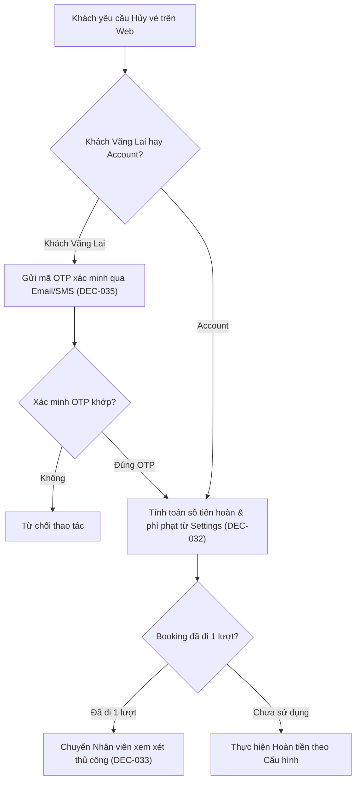

# Khách Chủ Động Đổi / Hủy Vé & Phí Phạt (DEC-032, DEC-033)

Hệ thống cung cấp cơ chế xử lý khi khách hàng chủ động hủy hoặc đổi chuyến đi theo cấu hình chính sách của Superdong.

---

## 🎯 Bài Toán Nghiệp Vụ & Quyết Định (DEC-032, DEC-033)

1. **Chính Sách Hủy Vé Theo Cấu Hình (DEC-032)**:
   - Mức phí phạt và % hoàn tiền được **quản lý linh hoạt trong Cấu hình hệ thống (`Settings`)** theo mốc thời gian trước giờ khởi hành (DEC-032). 
   - Hệ thống hỗ trợ hoàn tiền tự động hoặc nhân viên duyệt thủ công tùy theo cấu hình bật/tắt (DEC-014).
2. **Booking Đã Sử Dụng Một Phần (DEC-033)**:
   - Với đơn đặt vé khứ hồi đã sử dụng 1 lượt (lượt đi), **không tự động hoàn tiền trực tuyến**. Nhân viên phòng vé/quản lý phải xem xét và quyết định thủ công cho từng trường hợp.

---

## 💡 Ví Dụ Minh Họa Cấu Hình Phí Phạt (Illustrative Example)

> [!NOTE]
> Các con số dưới đây chỉ là **Ví dụ minh họa cấu hình** trong `Settings`. Quy tắc thực tế được nạp động từ CSDL tại thời điểm xử lý request.

| Mốc Thời Gian Trước Giờ Khởi Hành | Mức Phí Phạt (Ví Dụ Cấu Hình) | % Hoàn Tiền (Ví Dụ Cấu Hình) | Phương Thức Xử Lý |
| :--- | :--- | :--- | :--- |
| **Trước 24 giờ** | Phí cố định `X` VND | Hoàn `100% - X` | Tự động hoặc Staff duyệt (DEC-014) |
| **Từ 2 đến 24 giờ** | Tỷ lệ `Y%` tổng giá vé | Hoàn `100% - Y%` | Tự động hoặc Staff duyệt (DEC-014) |
| **Dưới 2 giờ** | `100%` giá vé | `0%` (Không hoàn) | Hệ thống từ chối tự động |

---

## 🪨 Chi Tiết Workflow Hủy Vé & Quản Lý OTP (DEC-035)

---

## 🗿 Grug Đúc Kết

<Callout type="tip">
  **🗿 Grug Kiến Trúc Mách Bảo**: *"Luật phạt đổi hủy vé nằm trong rương Cấu Hình Settings! Máy tự đọc mốc giờ rồi tính tiền hoàn, không ai được tự ghi đè con số!"*
</Callout>
