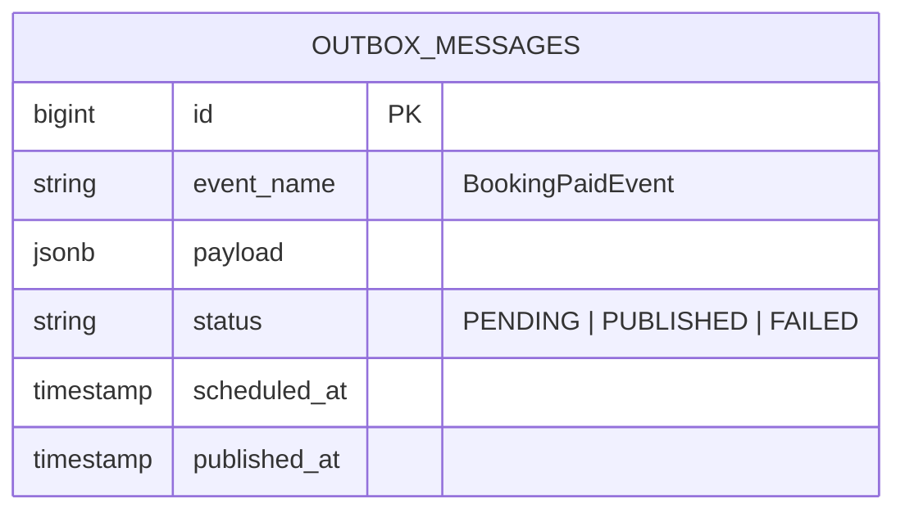

# Cronjob Tự Động Nhả Ghế Hết Hạn & Pattern Outbox

Vận hành nền tảng (Background Workers) đóng vai trò giữ cho kho ghế và luồng thông báo luôn hoạt động chính xác.

---

## 🎯 Bài Toán Nghiệp Vụ

1. **Auto-release Ghế Treo**: Khách đặt giữ ghế online 15 phút hoặc đặt quầy quá mốc `departure_time - X phút` nhưng không trả tiền. Ghế không thể bị treo vĩnh viễn làm mất doanh thu bán vé.
2. **Transactional Outbox Pattern**: Khi Booking thanh toán thành công, hệ thống phải gửi Email/SMS và đẩy data VAT. Nếu gửi mail trực tiếp trong HTTP Request, nếu Mail Server bị chậm sẽ làm treo API checkout của khách!

---

## 💡 Giải Pháp Kiến Trúc Backend

- **Cronjob Worker (Mỗi 1 phút)**:
  - Chạy `RELEASE_EXPIRED_BOOKINGS_TASK`: Quét tất cả Booking có `status = UNPAID` và `expires_at <= NOW()`.
  - Cập nhật `BOOKINGS.status = EXPIRED`, đồng thời trả `TRIP_SEAT_INVENTORIES.status = AVAILABLE`.
- **Outbox Pattern**:
  - Ghi bản ghi `outbox_messages` trong cùng 1 Database Transaction với lệnh thanh toán.
  - Worker chạy ngầm đọc `outbox_messages` và gửi Mail/SMS/Webhook bất đồng bộ (Asynchronous).

---

## 🪨 Chi Tiết ERD & Lý Giải TẠI SAO

### 🔍 Lý Giải TẠI SAO (Schema Rationale):
- **Vì sao ghi `OUTBOX_MESSAGES` vào DB thay vì bắn thẳng vào Queue?**: Nếu DB commit thành công nhưng Queue Worker bị gián đoạn, tin nhắn sẽ không bị mất. Lưu vào bảng DB `OUTBOX_MESSAGES` cùng Transaction đảm bảo tính toàn vẹn 100% (Guaranteed Delivery).

---

## 🗿 Grug Đúc Kết

<Callout type="tip">
  **🗿 Grug Kiến Trúc Mách Bảo**: *"Grug thu tiền xong thì khắc tin nhắn vào bảngOutbox! Thằng đệ Worker đứng cạnh tự nhìn bảng ghi mà gõ trống bồ câu đi gửi thư!"*
</Callout>
