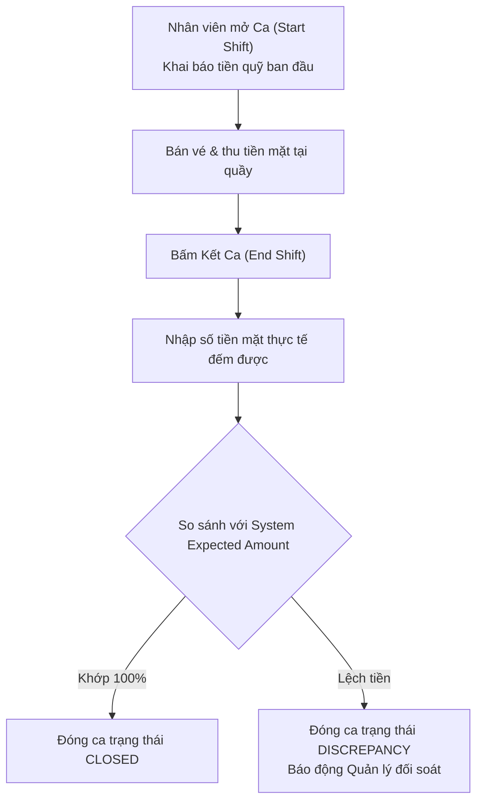
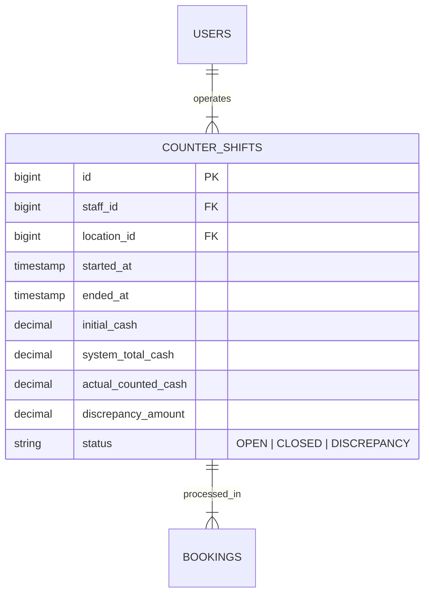

# Quản Lý Ca Làm Việc & Kết Ca (Shift Management & Cash Reconciliation)

Kiểm soát dòng tiền mặt thu được tại các quầy bán vé bến tàu Superdong.

---

## 🎯 Bài Toán Nghiệp Vụ

Nhân viên bán vé làm việc theo ca (Sáng / Chiều). Cuối ca, nhân viên phải thực hiện **Kết ca (End of Shift)**, đếm tổng số tiền mặt thực tế thu được trong hộc tiền và đối soát với tổng số tiền thu từ các Booking đã bán trong hệ thống.

---

## 💡 Giải Pháp Kiến Trúc Backend

---

## 🪨 Chi Tiết ERD & Lý Giải TẠI SAO

### 🔍 Lý Giải TẠI SAO (Schema Rationale):
- **Vì sao mọi `BOOKING` bán tại quầy phải lưu `shift_id` (FK)?**: Để khi phát hiện lệch tiền ở ca làm việc 14h-18h, Quản lý có thể lọc ngay lập tức toàn bộ các Booking phát sinh trong đúng `shift_id` đó để tìm ra hóa đơn bị nhầm lẫn.

---

## 🗿 Grug Đúc Kết

<Callout type="tip">
  **🗿 Grug Kiến Trúc Mách Bảo**: *"Hết ca đếm sò tiền mặt trong rương! Số sò cầm trên tay phải khớp 100% với chữ đục trên máy thì tù trưởng mới cho về chòi ngủ!"*
</Callout>
