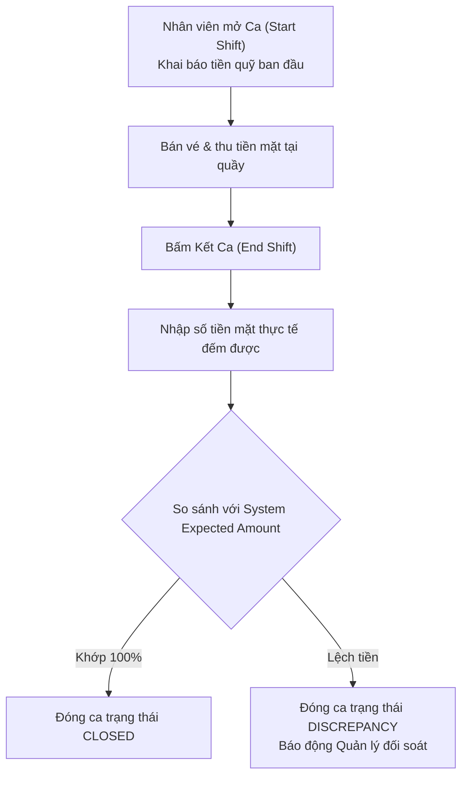
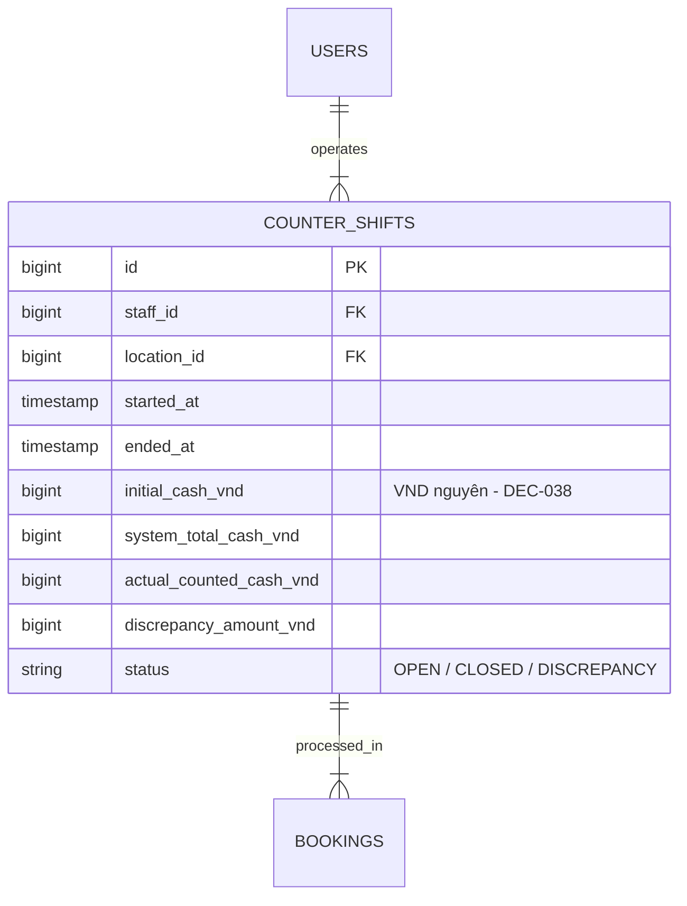

# Quản Lý Ca Làm Việc & Kết Ca (Candidate Capability Proposal)

> [!NOTE]
> **Lưu ý Nghiệp Vụ**: Quản lý ca làm việc (`COUNTER_SHIFTS`) là một **Tính năng Đề xuất (Candidate Capability Proposal)** dành cho các phiên bản mở rộng tiếp theo, chưa nằm trong các Quyết định nghiệp vụ cốt lõi (DEC-001 đến DEC-041) của phiên bản MVP.

---

## 🎯 Bài Toán Nghiệp Vụ Đề Xuất

Nhân viên bán vé làm việc theo ca (Sáng / Chiều). Cuối ca, nhân viên thực hiện **Kết ca (End of Shift)**, đếm tổng số tiền mặt thực tế thu được trong hộc tiền và đối soát với tổng số tiền thu từ các Booking đã bán trong hệ thống.

---

## 💡 Giải Pháp Kiến Trúc Đề Xuất (Proposal Workflow)

---

## 🪨 Chi Tiết ERD Đề Xuất (Candidate Schema)

---

## 🗿 Grug Đúc Kết

<Callout type="tip">
  **🗿 Grug Kiến Trúc Mách Bảo**: *"Hết ca đếm sò tiền mặt trong rương! Đây là tính năng mở rộng đề xuất để tù trưởng dễ quản lý hộc tiền phòng vé!"*
</Callout>
