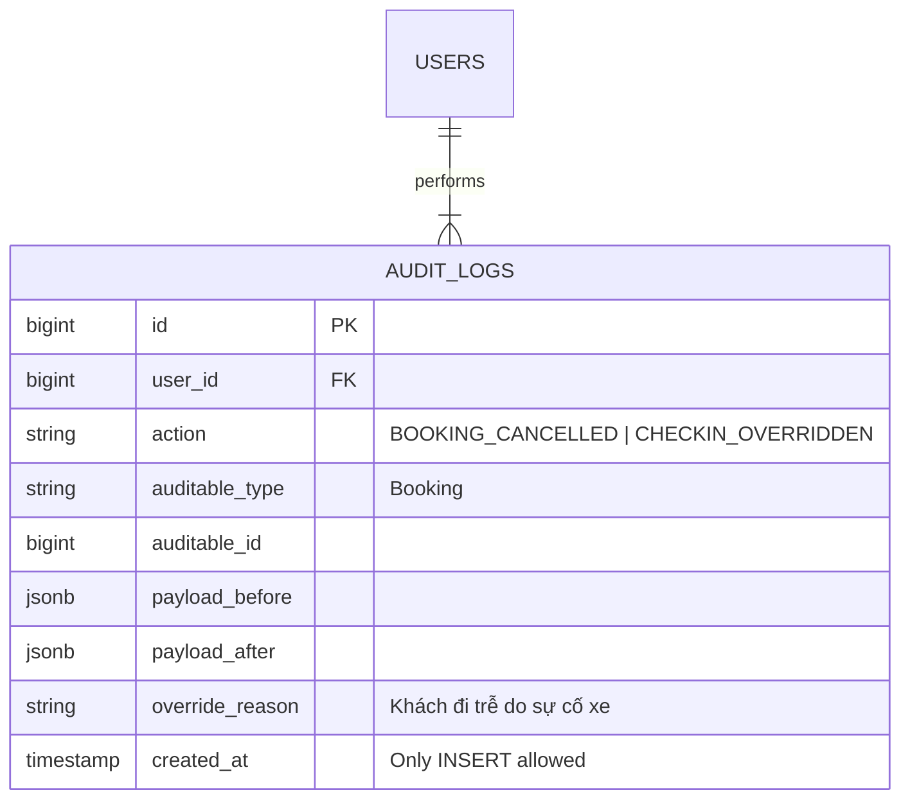

# RBAC Theo Bến & Nhật Ký Audit Log Bất Biến

Đảm bảo an ninh thông tin, phân quyền chặt chẽ và khả năng truy vết 100% mọi hành vi hệ thống.

---

## 🎯 Bài Toán Nghiệp Vụ & Quyết Định (DEC-034, DEC-041)

1. **Phân Quyền RBAC Theo Bến & Vai Trò (DEC-034)**:
   - Tách biệt 4 vai trò chính: Nhân viên Quầy, Vận hành, Soát vé và Quản lý.
   - Các quyền nhạy cảm như **Refund, Override đổi chuyến, Sửa Check-in nhầm thuộc đặc quyền của Quản lý (Manager)**.
   - Phân quyền theo Bến (Station-scoped): Nhân viên Bến Rạch Giá không xem hoặc thao tác được dữ liệu Bến Hà Tiên.
2. **Audit Log Bất Biến Append-only (DEC-041)**:
   - Nhật ký kiểm toán **bắt buộc lưu trữ**: Người thao tác (`who`), Thời gian (`when`), Lý do (`reason`) và Dữ liệu trước/sau (`before_payload` & `after_payload`).
   - **Quy tắc bất biến**: Audit Log chỉ đọc dạng Append-only. **Tuyệt đối CẤM sửa hoặc xóa bản ghi Audit Log** dưới bất kỳ hình thức nào!

---

## 💡 Giải Pháp Kiến Trúc Backend

- **Audit Middleware/Observer**: Mọi sự kiện `Created`, `Updated`, `Deleted` trên các bảng nhạy cảm (`bookings`, `payments`, `tickets`) tự động trigger ghi một dòng vào `audit_logs`.
- **Database Revoke Permission**: Tài khoản DB application chỉ có quyền `INSERT` và `SELECT` trên bảng `audit_logs`, bị `REVOKE UPDATE, DELETE`.

---

## 🪨 Chi Tiết ERD & Lý Giải TẠI SAO

### 🔍 Lý Giải TẠI SAO (Schema Rationale):
- **Vì sao lưu `payload_before` và `payload_after` dạng JSONB?**: Khi có tranh chấp hoặc nghi vấn gian lận vé, Quản lý có thể soi lại chính xác từng thuộc tính dữ liệu bị thay đổi tại thời điểm đó mà không phụ thuộc vào trạng thái hiện tại của DB.

---

## 🗿 Grug Đúc Kết

<Callout type="tip">
  **🗿 Grug Kiến Trúc Mách Bảo**: *"Mọi dấu chân đục vết trên bia đá Audit Log là vĩnh cửu! Không ai có quyền lấy rìu đục xóa dấu vết quá khứ!"*
</Callout>
