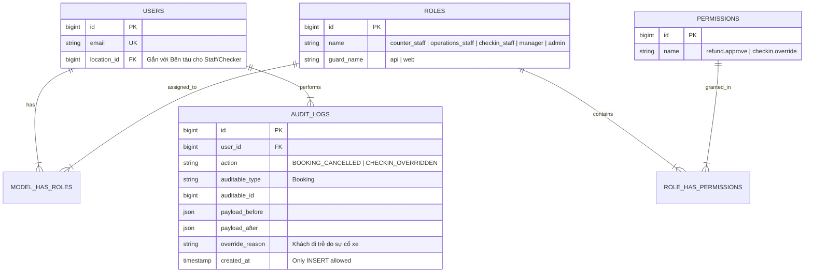

# Spatie RBAC Theo Bến & Nhật Ký Audit Log Bất Biến

Đảm bảo an ninh thông tin, phân quyền chặt chẽ theo package **`Spatie\Permission`** và khả năng truy vết 100% mọi hành vi hệ thống.

---

## 🎯 Bài Toán Nghiệp Vụ & Quyết Định (DEC-034, DEC-041)

1. **Phân Quyền Spatie RBAC Theo Bến & Vai Trò (DEC-034)**:
   - Tách biệt các vai trò kỹ thuật cụ thể: `counter_staff` (Nhân viên Quầy), `operations_staff` (Vận hành), `checkin_staff` (Soát vé), `manager` (Quản lý) và `admin` (Admin hệ thống).
   - `UserModel` áp dụng Trait `Spatie\Permission\Traits\HasRoles`. Bảng `users` tuyệt đối KHÔNG có cột `role` hay `roles`.
   - Các quyền nhạy cảm như **Refund, Override đổi chuyến, Sửa Check-in nhầm thuộc đặc quyền của Quản lý (`manager`)** (DEC-034, DEC-036).
   - Phân quyền theo Bến (Location-scoped): Nhân viên Bến Rạch Giá (`location_id`) không xem hoặc thao tác được dữ liệu Bến Hà Tiên.
2. **Audit Log Bất Biến Append-only (DEC-041)**:
   - Nhật ký kiểm toán **bắt buộc lưu trữ**: Người thao tác (`who`), Thời gian (`when`), Lý do (`reason`) và Dữ liệu trước/sau (`payload_before` & `payload_after`).
   - **Quy tắc bất biến**: Audit Log chỉ đọc dạng Append-only. **Tuyệt đối CẤM sửa hoặc xóa bản ghi Audit Log** dưới bất kỳ hình thức nào!

---

## 💡 Giải Pháp Kiến Trúc Backend (Spatie RBAC Tables)

Hệ thống phân quyền sử dụng 5 bảng tiêu chuẩn của Spatie:
- `users`: Thông tin người dùng (`location_id` trỏ về Bến tàu).
- `roles`: Danh sách vai trò (`counter_staff`, `operations_staff`, `checkin_staff`, `manager`, `admin`).
- `permissions`: Danh sách quyền (`booking.override`, `checkin.reverse`, `refund.approve`).
- `model_has_roles`: Bảng trung gian gán Role cho User.
- `role_has_permissions`: Bảng trung gian gán Permission cho Role.

---

## 🪨 Chi Tiết ERD & Spatie Authorization Schema

### 🔍 Lý Giải TẠI SAO (Schema Rationale):
- **Vì sao dùng Spatie RBAC thay vì Cột Enum `users.role`?**: Giúp linh hoạt gán thêm quyền đặc biệt cho từng tài khoản mà không cần sửa DB Schema.
- **Vì sao lưu `payload_before` và `payload_after` trong `AUDIT_LOGS`?**: Khi có tranh chấp hoặc nghi vấn gian lận vé, Quản lý có thể soi lại chính xác từng thuộc tính dữ liệu bị thay đổi tại thời điểm đó.

---

## 🗿 Grug Đúc Kết

<Callout type="tip">
  **🗿 Grug Kiến Trúc Mách Bảo**: *"Mọi dấu chân đục vết trên bia đá Audit Log là vĩnh cửu! Thẻ Spatie RBAC đeo trên cổ xác định đúng vị trí công việc từng người rừng!"*
</Callout>
