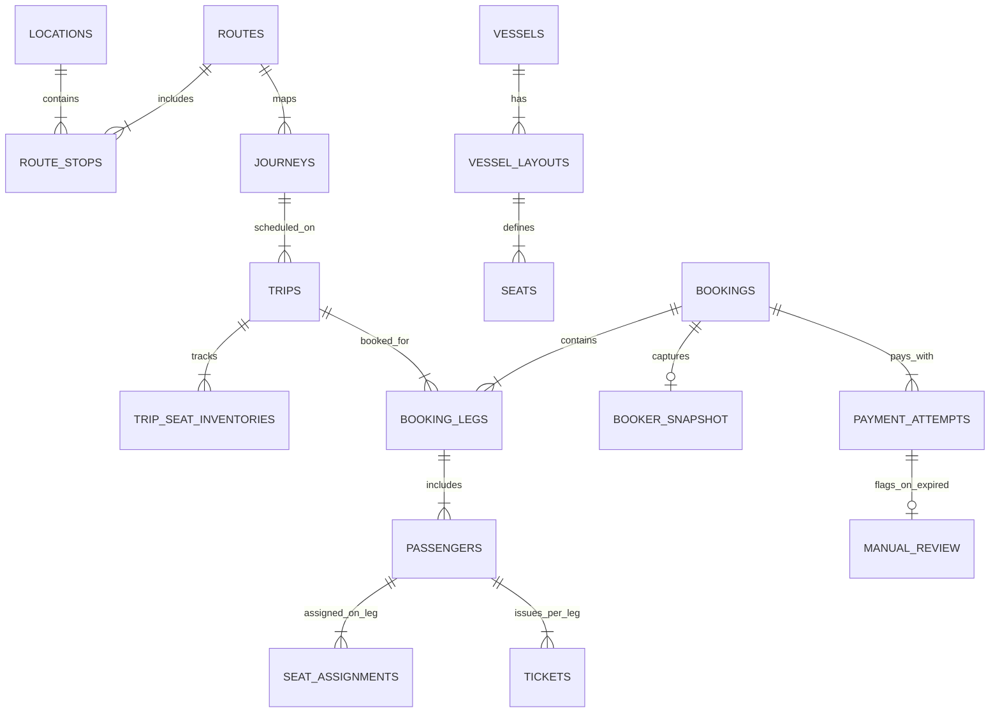

# Cẩm Nang Thiết Kế ERD & Schema Rationale Toàn Tập

> [!IMPORTANT]
> **NGUYÊN TẮC VÀNG DÀNH CHO DEVELOPER**: Trong hệ thống đặt vé, thanh toán, giữ ghế, check-in và hoàn tiền Superdong, **tuyệt đối KHÔNG ĐƯỢC NGẦM HIỂU hay TỰ SUY ĐOÁN nghiệp vụ**. Một nội dung chưa được ghi nhận thành Decision, Rule, Invariant hoặc Schema Contract chính thức thì **chưa được xem là yêu cầu đã chốt**.

---

## 1. Phân Biệt 4 Cấp Độ Chắc Chắn Của Tài Liệu

Để không vi phạm architecture test hoặc viết sai migration, Developer phải phân biệt rạch ròi 4 cấp độ thông tin:

```
 ┌────────────────────────────────────────────────────────┐
 │ 1.1. Đã Chốt Nghiệp Vụ (Official Business Decisions)   │ - docs/nghiepvu.md (DEC-001..041, INV-001..034)
 └───────────────────────────┬────────────────────────────┘
                             │
                             ▼
 ┌────────────────────────────────────────────────────────┐
 │ 1.2. Có Trong Logical ERD (Logical Architecture)       │ - docs/architecture/erd.md
 └───────────────────────────┬────────────────────────────┘
                             │
                             ▼
 ┌────────────────────────────────────────────────────────┐
 │ 1.3. Technical Plan Dự Kiến (Technical Workflow)       │ - docs/workflows/2026-08-03-...
 └───────────────────────────┬────────────────────────────┘
                             │
                             ▼
 ┌────────────────────────────────────────────────────────┐
 │ 1.4. Mã Nguồn Thực Tế Hiện Tại (Actual Source Code)    │ - UserModel.php, Spatie migrations
 └────────────────────────────────────────────────────────┘
```

1. **Đã Chốt Nghiệp Vụ (`docs/nghiepvu.md`)**:
   - Bao gồm DEC-001 đến DEC-041, INV-001 đến INV-034, State Machine và Acceptance Criteria.
   - *Ví dụ đã chốt*: Guest không bắt buộc tạo tài khoản; Booking chưa trả tiền không có vé/QR; Payment thành công sau khi hết hạn không tự khôi phục đơn; Đổi tàu khác layout phải chọn lại ghế; Chỉ Manager được sửa check-in nhầm; Cấm hard delete giao dịch; Tiền dùng VND nguyên.
2. **Có Trong Logical ERD (`docs/architecture/erd.md`)**:
   - Định nghĩa các khái niệm dữ liệu và quan hệ giữa chúng (ví dụ: `BOOKER_SNAPSHOT`, `PASSENGER_TYPE_SNAPSHOT`, `TICKET_VERSION`, `CHECK_IN_REVERSAL`).
3. **Technical Plan Dự Kiến (`docs/workflows/2026-08-03-...`)**:
   - Bổ sung các bảng kỹ thuật phục vụ concurrency, idempotency, scheduler, outbox và bảo mật (ví dụ: `trip_seat_inventories`, `command_idempotencies`, `outbox_messages`, `otp_challenges`).
4. **Mã Nguồn Thực Tế Hiện Tại (`E:\cty\superdong-be`)**:
   - Mã nguồn thực tế hiện mới chỉ có các bảng Nền Tảng Auth & Permission của Spatie: `users`, `roles`, `permissions`, `model_has_roles`, `role_has_permissions`, `model_has_permissions`. Các bảng nghiệp vụ Booking, Trip, Seat, Payment, Ticket... **chưa tạo migration trong code hiện tại**.

---

## 2. Phân Biệt 5 Loại Dữ Liệu Cốt Lõi

Nếu trộn lẫn 5 loại dữ liệu này, ERD sẽ bị sai ngay ở các bài toán đổi giá, đổi tàu, bán trùng ghế và hoàn tiền:

| Loại Dữ Liệu | Đại Diện Tiêu Biểu | Mục Đích & Trả Lời Câu Hỏi | Quy Tắc Quản Lý |
| :--- | :--- | :--- | :--- |
| **2.1. Master Data Hiện Hành** | `locations`, `routes`, `vessels`, `passenger_types`, `fare_rules`, `coupons`, `settings` | *"Hiện tại công ty đang cấu hình như thế nào?"* | Có thể thay đổi cho tương lai. Khi ngưng dùng thì chuyển `INACTIVE`, cấm hard delete nếu đã được tham chiếu. |
| **2.2. Snapshot Lịch Sử** | `booker_snapshots`, `passenger_type_snapshots`, `price_snapshots`, `coupon_applications`, `ticket_versions` | *"Tại thời điểm giao dịch được chốt, hệ thống đã dùng dữ liệu/chính sách nào?"* | Bất biến 100%. Không tự động thay đổi khi Master Data phía trên bị sửa đổi. |
| **2.3. Fact Nghiệp Vụ Bất Biến** | `payment_attempts`, `tickets`, `check_ins`, `trip_incidents`, `refund_obligations`, `audit_records` | *"Điều gì đã thật sự xảy ra trong quá khứ?"* | Tuyệt đối không sửa lịch sử. Nếu có sai sót, phải tạo record correction, reversal hoặc compensation mới. |
| **2.4. Registry Trạng Thái Hiện Tại** | `trip_seat_inventories` | *"Ghế A01 của chuyến X hiện tại đang trống, bị giữ hay đã bán?"* | Biểu diễn trạng thái hiện hành, được phép `UPDATE` nguyên tố trong Transaction. |
| **2.5. Bảng Kỹ Thuật Điều Phối** | `command_idempotencies`, `outbox_messages`, `processed_messages`, `booking_expiry_claims`, `notification_intents` | Ngăn tạo trùng đơn, thu tiền 2 lần, gửi email lặp, worker tranh chấp. | Phục vụ hạ tầng phân tán, đảm bảo tính toàn vẹn hệ thống. |

---

## 3. Quy Ước Thiết Kế Chuẩn Cho Tất Cả Các Bảng

1. **ID Nội Bộ & API Identity**:
   - CSDL dùng `BIGINT` tự tăng làm Primary Key nội bộ.
   - API Public không trả về raw database ID mà dùng `HashId` hoặc mã business identity (`booking_code`, `ticket_code`).
2. **Quản Lý Thời Gian (`Timestamps`)**:
   - `created_at`: Thời điểm tạo record.
   - `effective_from` / `effective_to`: Khoảng thời gian rule có hiệu lực.
   - `expires_at`: Thời điểm quyền tạm thời hết hạn.
   - `occurred_at`: Thời điểm sự kiện thực tế xảy ra.
3. **Phân Biệt `status` và `state`**:
   - `status`: Trạng thái hành chính Master Data (`ACTIVE`, `INACTIVE`).
   - `state`: Trạng thái trong Vòng đời nghiệp vụ (`PendingOnline`, `Confirmed`, `Expired`). Mỗi transition bắt buộc đi qua Task guard.
4. **Chuẩn Tiền Tệ VND (DEC-038)**:
   - Chỉ dùng đơn vị VND, không lưu số lẻ thập phân (`DECIMAL(..., 2)`).
   - Tên trường: `amount_vnd`, `total_amount_vnd`, `refund_amount_vnd`.
   - Phép làm tròn chỉ thực hiện ở tổng cuối cùng trong PHP Pricing Task.
5. **Dữ Liệu JSON Trong MySQL**:
   - Dùng kiểu dữ liệu `json` chuẩn MySQL (không dùng kiểu dữ liệu Postgres-specific).
   - Chỉ dùng JSON cho payload linh hoạt (before/after payload, seat layout matrix). Các trường filter, join, sort bắt buộc là cột riêng.
6. **Cấm Hard Delete Fact Giao Dịch (DEC-039)**:
   - Cấm dùng `SoftDeletes` hay `DELETE` đối với `BOOKINGS`, `PAYMENT_ATTEMPTS`, `TICKETS`, `CHECK_INS`. Lifecycle quản lý 100% bằng State Machine.

---

## 4. Chi Tiết Các Bảng Authentication & Authorization (Spatie RBAC)

- **`users`**: Tài khoản đăng nhập (Khách có tài khoản, Counter Staff, Operations Staff, Check-in Staff, Manager, Admin). **Bảng `users` KHÔNG CÓ cột `role` hay `roles`**. `Guest` có `user_id = NULL` trên `BOOKINGS`.
- **`roles`**: Danh sách vai trò Spatie (`counter_staff`, `operations_staff`, `checkin_staff`, `manager`, `admin`).
- **`permissions`**: Danh sách quyền hạn granular (`booking.override`, `checkin.reverse`, `refund.approve`).
- **`model_has_roles`**, **`role_has_permissions`**, **`model_has_permissions`**: Các bảng liên kết đa hình tiêu chuẩn của Spatie Permission Package.

---

## 5. Danh Sách Các Bảng Chi Tiết & Lý Giải TẠI SAO (Schema Rationale)



### 🔍 Lý Giải TẠI SAO Cho Từng Bảng Cốt Lõi:

1. **`locations` (Bến Tàu / Điểm Dùng)**: Đại diện bến xuất phát/cập bến (`code`, `name`). Tránh sai chính tả và làm ID chuẩn để join (Không tạo bảng trùng nghĩa).
2. **`vessel_layouts` (Phiên Bản Sơ Đồ Tàu)**: Quản lý version sơ đồ ghế động (`version_no`). Khi tàu sửa đổi số ghế từ 275 sang 300, các vé quá khứ vẫn giữ `version_no` cũ để đối soát chuẩn xác.
3. **`trip_seat_inventories` (Kho Ghế Theo Chuyến)**: Bảng Registry duy nhất đại diện trạng thái ghế hiện tại cho cặp `(trip_id, seat_id)`. Chứa `locked_by_booking_id` để giải phóng nhanh khi đơn bị `EXPIRED`.
4. **`booker_snapshots`**: Lưu thông tin người đặt vé tại thời điểm mua (`full_name`, `email`, `phone`). Đảm bảo khi User đổi SĐT/Email sau này thì lịch sử đơn cũ không bị méo mó.
5. **`seat_assignments`**: Tách việc gán ghế theo cặp `(passenger_id, booking_leg_id)`. Giúp vé khứ hồi có thể chọn ghế `A01` ở lượt đi nhưng ngồi ghế `B12` ở lượt về.
6. **`payment_attempts` & `manual_review`**: Lưu từng lần thử thanh toán (`PAYMENT_ATTEMPTS`). Khi thanh toán muộn sau khi đơn hết hạn (DEC-030), đẩy sang `MANUAL_REVIEW` cho Staff xử lý thủ công, tuyệt đối không tự cấp vé.
7. **`audit_records`**: Nhật ký kiểm toán Append-only (DEC-041). Lưu `payload_before` và `payload_after` dạng `json` để Quản lý soi lại dấu vết khi có khiếu nại.

---

## 🗿 Grug Đúc Kết

<Callout type="tip">
  **🗿 Grug Kiến Trúc Mách Bảo**: *"Tách bảng ra rõ ràng không phải để làm khó nhau! Tách ra để khi tàu đổi ghế, khách đổi giờ hay mạng lỗi chuyển tiền muộn, tù trưởng mở phiến đá ra là thấy ngay sự thật 100%!"*
</Callout>
