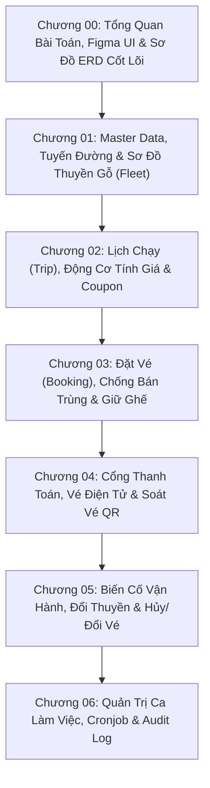

# Cẩm Nang Kiến Trúc & Nghiệp Vụ Superdong Booking System

Chào mừng bạn đến với **Cẩm Nang Kiến Trúc & Nghiệp Vụ Superdong Booking System** — bộ tài liệu chuẩn hóa dành riêng cho Developer và System Architect khi phát triển và bảo trì mã nguồn dự án **`E:\cty\superdong-be`**.

---

## 🎯 Mục Tiêu Bộ Sách

1. **Nắm Chắc Bản Chất Nghiệp Vụ Thực Tế**: Hiểu rõ từng góc khuất vận hành bến tàu biển (Chống bán trùng ghế Tết, giữ chỗ quầy, sự cố đổi tàu khác sơ đồ, hoãn/hủy chuyến do bão, thanh toán quá hạn).
2. **Hiểu Tận Gốc Thiết Kế ERD & Database**: Lý giải **TẠI SAO** từng bảng DB và từng khóa ngoại (Foreign Key) được chia tách và liên kết như vậy.
3. **Tuân Thủ 100% 41 Quyết Định Kiến Trúc (DEC-001 -> DEC-041)**: Bảng quy chuẩn 29 quyết định từ **Sếp Hùng** và 12 quyết định từ **Sếp Hiếu**.
4. **Truyền Tải Theo Phong Cách Grug Architect Comics**: Ẩn dụ Người Rừng Grug mộc mạc, hài hước, chống phức tạp hóa (Anti-Overengineering).

---

## 🗺️ Lộ Trình 7 Pha Học Tập Nghiệp Vụ

---

## 📚 Danh Mục 7 Chương Học Tập Chi Tiết

| Chương | Tên Chương & Nội Dung Trọng Tâm | Bài Học Tiêu Biểu |
| :--- | :--- | :--- |
| **Chương 00** | **Tổng Quan Nghiệp Vụ & Sơ Đồ ERD** | 6 Màn hình Figma UI, Bounded Contexts, Porto Architecture & 41 DEC. |
| **Chương 01** | **Master Data & Sơ Đồ Ghế Tàu** | Bến tàu, Tuyến đường, Sơ đồ ghế JSON & Cấu hình Em bé (DEC-020). |
| **Chương 02** | **Lịch Chạy, Dynamic Pricing & Coupon** | Vòng đời Trip, Fare Engine tính giá dynamic & Coupon cộng dồn (DEC-023). |
| **Chương 03** | **Đặt Vé, Khóa Ghế & Booker** | Booker vs Passenger, Giữ ghế Online/Quầy & Redis Lock chống bán trùng. |
| **Chương 04** | **Thanh Toán, Vé Điện Tử & QR Check-in** | Webhook VNPAY/MoMo, Reconcile quá hạn (DEC-030), QR Check-in & Retail Invoice. |
| **Chương 05** | **Biến Cố Vận Hành & Hủy/Đổi Vé** | Đổi tàu khác sơ đồ (DEC-002..005), Hủy/Đổi giờ chạy & Phí phạt hủy vé. |
| **Chương 06** | **Quản Trị Ca, Cronjob & Audit Log** | Cronjob nhả ghế, Outbox Pattern, Kết ca phòng vé & Audit Log Append-only (DEC-041). |

---

<Callout type="tip">
  **🗿 Grug Kiến Trúc Mách Bảo**: *"Code như người rừng, tư duy như kiến trúc sư! Đọc mượt từng chương để gõ code Backend Superdong chuẩn xác 100%!"*
</Callout>
